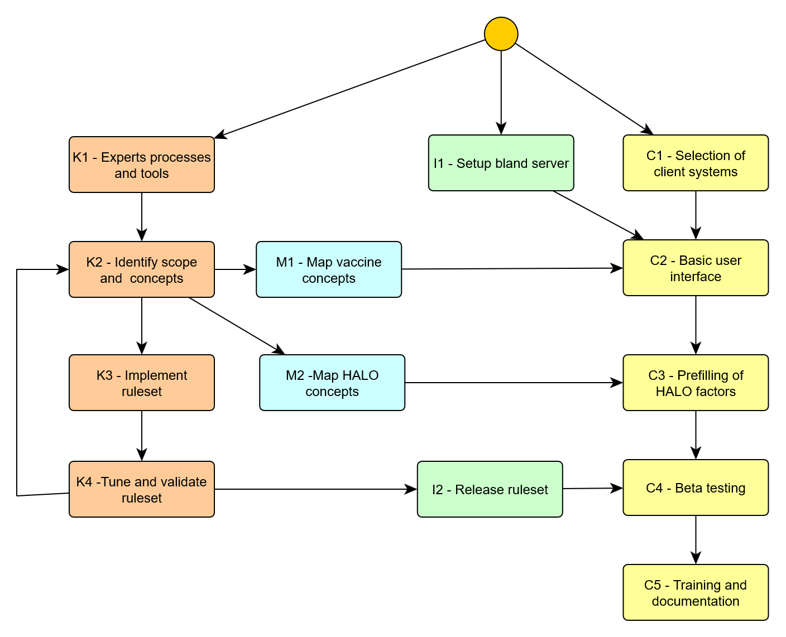
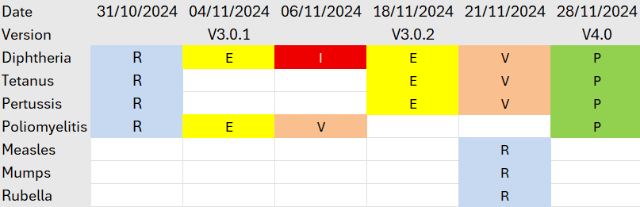

# CLINICAL DECISION SUPPORT SYSTEM (CDS) - DEPLOYMENT

# Project team

The project team is composed of the following key members:

-   **Project Manager**: Assigned by the Health authority, responsible for overall coordination and ensuring timely delivery.
-   **Immunisation Experts:** Specialists from the implementing MS who will:
    -   Collate reference documents for the project.
    -   Assist with translation, if necessary.
    -   Validate the ruleset and ensure the relevance of reference documents to the test cases.
-   **CDS provider team**:
    -   **Technical team**: Responsible for delivering the software platform that hosts the CDS.
    -   **Medical team**: Develops the ruleset based on the reference documents, creates test cases, and drafts justification messages for system users.
-   **Communication experts**: Experts from the MS responsible for adapting and translating the justification messages to suit the local context and ensure clarity for the target audience.
-   **Client Medical Application Editors**:
    -   Interface their applications with the CDS.
    -   Contribute to the mapping of terminologies
    -   Document the CDS integration.
    -   Deliver the CDS feature to end users.
    -   Provide training and support for effective system usage.
-   **Beta end users:** These are end users involved in testing the CDS feature for verification and feedback, ensuring that the solution meets practical requirements before full-scale implementation.

# Workflow

The project combines an initial deployment of technical components and the setup of a continuous improvement loop for knowledge components.

The initial deployment of technical components consists of:

-   Deploying and configuring a CDS server
-   Interfacing the client systems with the CDS server

The continuous improvement loop for knowledge components aims to deliver:

-   The rulesets that are used by the CDS server to elaborate and document the recommendations.
-   The mapping between the vocabularies used by the CDS rules and the ones used by each client system: codes for administered vaccines, representation of the HALO factors conditioning the recommendation.

The diagram below provides a high-level view of the dependencies between the technical deployment and the knowledge elaboration.

*Figure 1- Implementation workflow overview*

The following sections provide a detailed breakdown of each task involved in the implementation process.

## I1 – Setup of bland server

At the outset of the project, the CDS provider delivers a generic version of the CDS. This initial version is equipped with a default, English-language ruleset, and a minimalistic interface that enables users to submit queries and display recommendations.

This serves two purposes:

-   **Interface Exposure:** It exposes compliant interfaces for the client systems, allowing the development teams to begin building the user interfaces.
-   **Testing and Familiarization:** It allows the MS immunization experts to experiment with the CDS, gaining insights into how the system operates and what types of justification messages it can generate.

This basic CDS setup will be updated later (in Task I2) with a more customized ruleset specific to the project’s objectives.

## K1 – Experts processes and tools

During this task, the methods used for collaboration between the MS immunization experts and the CDS provider medical team are established. Methods are required:

-   For expressing the required scope of a next ruleset to be released.
-   For bidirectional communication media on the required features or corrections and tracking their realisation.
-   For asserting the current status of a ruleset.
-   For checking the validity of a proposed ruleset.
-   For translating and tuning the messages accompanying the recommendations.

### Expressing the scope of a ruleset

An iteration over the ruleset is characterized by:

-   A list of target diseases (e.g. – Influenza and COVID-19)
-   A list of HALO factors to be considered (e.g. – Older people, immuno-compromised patients)

It must be expressed unambiguously at the start of each iteration.

### Communication media between the experts

This would typically be a ticketing system proposed by the CDS provider, allowing to express new demands or notify of detected errors, and to keep track of interactions.

### Asserting the status of a ruleset

The accumulation of rules through successive iterations may make it difficult to keep track of the status of a candidate ruleset. It is suggested to organize it as a timetable per target disease, with a status such as:

-   Requirements provided (R)
-   Rules exposed for review (E)
-   Rules validated (V)
-   Rules released to production (P)
-   Issue detected (I)

This view could be coupled with the ticketing system mentioned above.

*Figure 2 - Example of tracking table*

### Checking the validity of a ruleset

A ruleset is considered as valid for a given disease if it provides the correct answers on the action to be done and the due date. To determine this, the immunisation experts have two complementary options:

-   Direct inspection of the ruleset.
-   Intensive test of the ruleset against test cases.

In both cases, the method should be incremental and assisted. Rulesets for a comprehensive vaccination policy are huge and check of all rules against all diseases would be an overconsuming task for the experts.

For direct check, the rules should be expressed in a form that allows to compare easily across rulesets, such as the [scripted syntax](https://github.com/EUVABECO/CDS_rules/blob/main/grammar.md) used to publish the rules elaborated during the EUVABECO project. Such a textual format is easily handled in a configuration management tool, allowing to visualize instantly changes across releases.

Yet, the most natural method for checking is to run the ruleset against a set of realistic test cases, representing the different patient situations that were aimed by the successive releases of rules. To allow this, the CDS provider should provide to the experts a specific test environment, where:

-   Test profiles, consisting of patient HALO factors and vaccination history, can be stored.
-   Different versions of a ruleset can be executed between these test profiles, the results presented and the differences in results highlighted.
-   Assessment of the results by the experts can be registered and documented.

The environment where the experts test the candidate ruleset should be distinct from the production one.

### Translating and tuning the messages

Beside the correct clinical answers validated by the experts, the CDS should also provide justification messages that are relevant, impactful and adapted to the audience using the client system (a public facing system would not use the same terms as a system addressing only trained health professionals).

The communication experts must be given a tool to easily translate (if needed) and adapt the justification messages to their audience. This could be done with structured data exchange (for example using the rules syntax mentioned above) or by granting them access to collaborative tools such as the [Weblate platform](https://hosted.weblate.org/) that was used during the EUVABECO project.

## K2 – Identify scope and concepts

This phase is repeated at the start of each iteration of the knowledge loop.

During this phase, immunization experts from the MS perform the following tasks:

-   **Determine the Scope of the CDS:** The experts define the scope of the CDS according to the project's specific purpose. This can cover all vaccinations, or be limited to specific groups, such as children, adults, employees, or individuals with particular health conditions. It may also target specific diseases or be used for defined purposes like travel vaccines or the issuance of certificates.
-   **Collate and Translate Documents:** The experts gather all relevant recommendation documents, synthesizing the information and translating it into English for the CDS provider’s medical team. These documents will serve as the foundation for drafting the ruleset that will guide the CDS.
-   **Identify the required concepts:** Based upon the scope and their local context, the experts identify the list of relevant vaccine products and the HALO factors that will have to be exposed in the user interface of the client systems.

## K3 – Implement ruleset

Based on the recommendations provided by the MS immunization experts, the medical team from the CDS provider digitizes these recommendations and creates the initial draft of the ruleset.

This draft includes:

-   **First draft of the rules**: The ruleset offers recommendations for selected diseases and provides status classifications (such as due, overdue, immune, contraindicated, complete, or aged out) as well as, where applicable, due dates for vaccinations. These recommendations come with initial justification messages, written in English, that explain the reasoning behind the guidance.
-   **Creation of a Clinical Case Base:** The CDS provider medical team creates a foundational set of clinical cases, which will be used to test the proper application of each rule in the ruleset.

The clinical case base serves two essential functions:

-   **Validation:** It will be used as the foundation for the MS immunization experts to validate the ruleset (as described in Task K4).
-   **Test Bed for Future Changes:** The case base will act as a testing ground for validating any future modifications to the ruleset.

During this development phase, the CDS provider medical team may engage with the MS immunization experts to clarify and expand on the recommendations provided, ensuring that the ruleset aligns with the intended medical guidelines.

## K4 – Tune and validate ruleset

Once the first version of the ruleset has been developed, it is deployed on the CDS server provided at the project’s initiation. At this stage, **Member State (MS) immunization experts** are tasked with validating the ruleset by:

-   **Testing Against Clinical Cases**: The experts will test the ruleset’s recommendations using the base of clinical cases.
-   **Interactive Testing**: MS immunization experts can also test the system using real-world data from their national immunization systems by querying the CDS server directly.

Concurrently, the MS immunization experts will work with the **MS communication team** to replace the preliminary English-language justifications (created in Task A3) with more customized messages tailored to their respective national audiences.

Interactions between the MS immunization experts and the CDS provider’s medical team will be needed to:

-   **Address Discrepancies**: Any differences between the actual recommendations produced by the CDS and the expected outcomes need to be corrected.
-   **Refine Justification Targeting**: Additional rules may be necessary to adapt certain parts of the justification messages for specific patient subgroups or to address nuanced local needs.

## I2 – Release ruleset

Once the ruleset and the messages have been validated by the experts, they can be released to production under the control of the CDS provider. This release has to be accompanied with a release note stating the changes and limits of the new version, accessible to all users through a documented interface.

# Typical planning

The overall planning for the deployment and the first round of knowledge capture could thus be as follows:

| Task                             | M1 | M2 | M3 | M4 | M5 | M6 |
|----------------------------------|----|----|----|----|----|----|
| I – CDS Server implementation    |    |    |    |    |    |    |
| I1 – Setup bland CDS server      | X  |    |    |    |    |    |
| I2 – Release ruleset             |    |    |    |    | X  |    |
| K – Knowledge management         |    |    |    |    |    |    |
| K1 – Experts processes and tools | X  |    |    |    |    |    |
| K2 – Identify scope and concepts |    | X  |    |    |    |    |
| K3 – Implement ruleset           |    |    | X  |    |    |    |
| K4 – Tune and validate ruleset   |    |    |    | X  | X  |    |
| M – Semantic mapping             |    |    |    |    |    |    |
| M1 – Mapping of vaccines codes   |    | X  |    |    |    |    |
| M2 – Mapping of HALO factors     |    |    | X  |    |    |    |
| C – Client system delivery       |    |    |    |    |    |    |
| C1 – Selection of client systems | X  |    |    |    |    |    |
| C2 – Basic user interface        |    | X  |    |    |    |    |
| C3 – Prefilling of HALO factors  |    |    | X  |    |    |    |
| C4 – Beta testing                |    |    |    | X  | X  |    |
| C5 – Training and documentation  |    |    |    |    |    | X  |

# Build resources

## Tool specifications

Although this implementation plan is not tied to any particular CDS tool, the pilot projects were executed using the CDS implemented by SYADEM, which has been deployed both in France (under the brand MesVaccins.net, serving both citizens and professional users) and in Luxembourg (as part of the national health data platform under the CVE - Carnet de Vaccination Electronique - for citizens and professionals).

This specific CDS tool offers several key features:

-   **Delivered as a Service**: It provides a comprehensive solution, including the recommendation engine, its presentation as a web service, and the medical expertise required to formalize the decision support rules.
-   **Stateless Architecture**: It uses REST (Representational State Transfer) architecture, meaning no data is stored on CDS servers. All data is processed without retaining any information between sessions.

## Standard CDS API

HL7 has published in 2021 a [candidate implementation guide](https://hl7.org/fhir/us/immds/) for a FHIR interface to a CDS. This proposal only addressed general recommendations, not considering the patient specific HALO factors.

The EUVABECO project has contributed to the framing of a new version, [ImmDS+HALO](https://confluence.hl7.org/spaces/PHWG/pages/413254075/ImmDS+HALO+-+IG+First+Pass+Draft), based upon the learnings of the project and the previous experience of partners. At the time of writing this new version is still to come, but it will be a valuable resource to facilitate the integration with a variety of client systems already handling FHIR resources.

## Rulesets

The EUVABECO project shared publicly the [rulesets](https://github.com/EUVABECO/CDS_rules) elaborated during the EUVABECO project. Any reuse of these is submitted to the prior approval of the implementing partner and SYADEM.

## Knowledge management procedure

During the project, the **decision support rules** were developed by SYADEM medical experts, following a documented [knowledge management procedure](Resources/knowledge_mgt.md).
