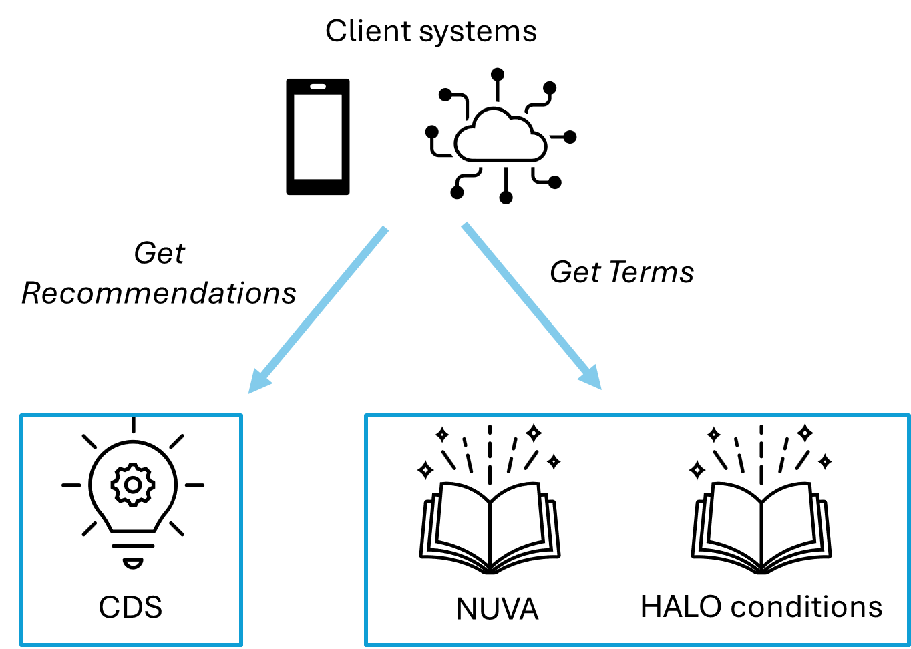

# CLINICAL DECISION SUPPORT SYSTEM (CDS) - ARCHITECTURE

| *This module details the architecture of the CDS tool as it as been envisioned and deployed within the EUVABECO project. Assumptions made with this architecture, although minimal, condition the CDS deployment plan described in module 11.* |
||

# Architecture

The CDS consists of two key components: a software engine and datasets representing knowledge about the vaccine’s characteristics, the relevant conditions for assessing a vaccination audit, and the rules used to determine the recommended vaccinations to perform, complemented with the messages presented to justify these recommendations.

Any flaw in these components could result in inaccurate recommendations. To comply with MDR regulations, one entity must manage both the software and the embedded knowledge with secure, controlled processes. To ensure security and continuous updates, the CDS must be provided as a managed service by a CDS provider, who will handle updates in line with changing rules.

The provider is responsible for integrating knowledge into the system, using various technical methods (e.g., hardcoded logic, parametrization, rules engines) and operational processes. Even if a health authority provides a digitized recommendation, such as the CDSi[^1] provided by the US CDC, the CDS provider remains accountable for the system’s integrity.

[^1]: https://www.cdc.gov/vaccines/programs/iis/cdsi.html

Managing the system centrally, rather than distributing software to individual health facilities, simplifies the update process. This is the approach taken in this plan. However, the CDS service will be accessed by users through client software, which will generate requests, submit them to the CDS, and receive justified recommendations in response. For client systems to communicate effectively with the CDS, they must use a common vocabulary, specifically:

-   **Administered vaccines**: In the scope of this project, we will use the NUVA[^2] terminology also applied for the EVC.
-   **Patient profiles (HALO conditions):** Health, Age, Living conditions and Occupation (HALO) profile relevant to vaccination rules.

[^2]: https://nuva.syadem.com/

Terminology servers will be publicly available to ensure the consistent use of these terms between the CDS and client systems.

The overall architecture is summarized as follows:

Figure 1-CDS overall architecture

In this architecture, the CDS is a stateless server, meaning it does not retain any data between transactions. This design offers several key benefits:

-   **Scalability:** More CDS server instances can be added behind a load balancer to handle increasing client requests, with each request routed to a different server.
-   **Resilience**: Multiple CDS server instances can be distributed across different locations, improving reliability in case of server or connectivity failures.
-   **Personal data protection:** Since all data is transient and no directly identifying information is submitted, personal data protection is enhanced. Only the patient’s characteristics and vaccination history are relevant for the CDS's operations.
-   **Simplified support and maintenance:** A generic system can be adapted to different contexts, making it easier to maintain and support across diverse use cases.
