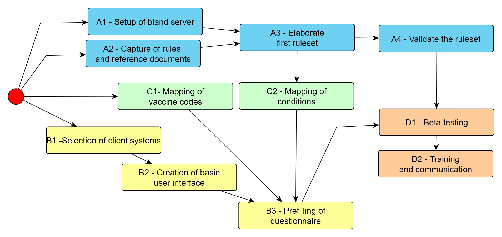

# CLINICAL DECISION SUPPORT SYSTEM (CDS) - DEPLOYMENT

| *This module describes the resources, workflow and planning for the deployment of the CDS tool.* |
|--|

# Project team

The project team is composed of the following key members:

-   **Project Manager**: Assigned by the Health authority, responsible for overall coordination and ensuring timely delivery.
-   **Immunisation Experts:** Specialists from the implementing MS who will:
    -   Collate reference documents for the project.
    -   Assist with translation, if necessary.
    -   Validate the ruleset and ensure the relevance of reference documents to the test cases.
-   **CDS provider team**:
    -   **Technical team**: Responsible for delivering the software platform that hosts the CDS.
    -   **Medical team**: Develops the ruleset based on the reference documents, creates test cases, and drafts justification messages for system users.
-   **Communication experts**: Experts from the MS responsible for adapting and translating the justification messages to suit the local context and ensure clarity for the target audience.
-   **Client Medical Application Editors**:
    -   Interface their applications with the CDS.
    -   Document the CDS integration.
    -   Deliver the CDS feature to end users.
    -   Provide training and support for effective system usage.
-   **Beta end users:** These are end users involved in testing the CDS feature for verification and feedback, ensuring that the solution meets practical requirements before full-scale implementation.

# Workflow

The project follows three main workstreams, which will converge into a final delivery process:

1.  **CDS server setup:** Ensuring the CDS server, along with the appropriate medical ruleset, is made available for use.
2.  **Client System Integration:** Developing and implementing the interface between the CDS and the client systems.
3.  **Data Mapping**: Mapping the existing data within client systems to align with the concepts required by the CDS.

The diagram provides a high-level view of the dependencies between tasks in the three primary branches of the project: setting up the CDS server, interfacing client systems with the CDS, and mapping client data to CDS concepts. Each task in these branches plays a critical role in delivering a functioning CDS system.

Figure 1 - Implementation workflow overview

The following sections provide a detailed breakdown of each task involved in the implementation process.

## A1 – Setup of bland CDS server

At the outset of the project, the CDS provider delivers a generic version of the CDS. This initial version is equipped with a default, English-language ruleset, and a minimalistic interface that enables users to submit queries and display recommendations.

This serves two purposes:

-   **Interface Exposure:** It exposes compliant interfaces for the client systems, allowing the development teams to begin building the user interfaces.
-   **Testing and Familiarization:** It allows the MS immunization experts to experiment with the CDS, gaining insights into how the system operates and what types of justification messages it can generate.

This basic CDS setup will be updated later (in Task A3) with a more customized ruleset specific to the project’s objectives.

## A2 – Capture of rules and reference documents

During this phase, immunization experts from the MS perform the following tasks:

-   **Determine the Scope of the CDS:** The experts define the scope of the CDS according to the project's specific purpose. This can cover all vaccinations, or be limited to specific groups, such as children, adults, employees, or individuals with particular health conditions. ). It may also target specific diseases or be used for defined purposes like travel vaccines or the issuance of certificates.
-   **Collate and Translate Documents:** The experts gather all relevant recommendation documents, synthesizing the information and translating it into English for the CDS provider’s medical team. These documents will serve as the foundation for drafting the ruleset that will guide the CDS.

## A3 – Elaborate first ruleset

Based on the recommendations provided by the MS immunization experts, the medical team from the CDS provider digitizes these recommendations and creates the initial draft of the ruleset.

This draft includes:

-   **First draft of the rules**: The ruleset offers recommendations for selected diseases and provides status classifications (such as due, overdue, immune, contraindicated, complete, or aged out) as well as, where applicable, due dates for vaccinations. These recommendations come with initial justification messages, written in English, that explain the reasoning behind the guidance.
-   **Creation of a Clinical Case Base:** The CDS provider medical team creates a foundational set of clinical cases, which will be used to test the proper application of each rule in the ruleset.

The clinical case base serves two essential functions:

-   **Validation:** It will be used as the foundation for the MS immunization experts to validate the ruleset (as described in Task A4).
-   **Test Bed for Future Changes:** The case base will act as a testing ground for validating any future modifications to the ruleset.

During this development phase, the CDS provider medical team may engage with the MS immunization experts to clarify and expand on the recommendations provided, ensuring that the ruleset aligns with the intended medical guidelines.

## A4 – Validate the ruleset and tune the justifications

Once the first version of the ruleset has been developed, it is deployed on the CDS server provided at the project’s initiation. At this stage, **Member State (MS) immunization experts** are tasked with validating the ruleset by:

-   **Testing Against Clinical Cases**: The experts will test the ruleset’s recommendations using the base of clinical cases.
-   **Interactive Testing**: MS immunization experts can also test the system using real-world data from their national immunization systems by querying the CDS server directly.

Concurrently, the MS immunization experts will work with the **MS communication team** to replace the preliminary English-language justifications (created in Task A3) with more customized messages tailored to their respective national audiences.

Interactions between the MS immunization experts and the CDS provider’s medical team will be needed to:

-   **Address Discrepancies**: Any differences between the actual recommendations produced by the CDS and the expected outcomes need to be corrected.
-   **Refine Justification Targeting**: Additional rules may be necessary to adapt certain parts of the justification messages for specific patient subgroups or to address nuanced local needs.

## B1 – Selection of client systems

The **MS project management team** will identify one or more systems to interact with the CDS, depending on the existing national infrastructure and the intended audience.

The systems selected may include:

-   **Standalone interface:** This interface enables users (health professionals or the general population) to manually enter or download data and send queries to the CDS on an ad-hoc basis (use cases UC01, UC05).
-   **Centralized Service:** This service would store immunization histories and personal profiles, making them accessible upon request (UC02) or periodically for tracking individual or collective vaccination statuses (UC03 and UC04). This is typically used in national Immunization Information Systems (IIS).
-   **Broker service**: A broker can forward CDS queries from other systems that it already serves, such as a centralized medical documents repository., In this setup, data from structured documents submitted by practitioners or health structures, is used to generate recommendations, which are then shared as new documents.
-   **Distributed applications:** These are systems used by practitioners and health structures.
-   **Mobile applications**: Designed for citizens to use on their personal devices.

Each client system will interact with the CDS differently depending on the richness of the data it manages. It may simply pass data through to the CDS or retrieve and integrate a patient's vaccination history and profile.

## B2 – Creation of basic user interface

To perform the vaccination audit, the CDS needs three sets of information:

-   **Basic demographic data**: This includes information like the patient’s date of birth, sex, and place of residence.
-   **Vaccination History:** A record of the patient’s previously administered vaccines.
-   **Patient Profile**: This refers to the set of all relevant HALO (Health, Age, Living conditions and Occupation) conditions.

While **basic demographic data** (such as date of birth, sex, and place of residence) and the **vaccination history** of administered vaccines may be automatically retrieved from existing client systems, the **patient profile** presents more complexities. The patient profile, crucial for generating personalized vaccination recommendations, is unlikely to be fully retrieved from a client system without user interaction. This is especially true if the CDS is expected to go beyond providing basic recommendations.

The patient profile consists of HALO conditions, which are numerous (over 200 conditions in the French recommendations alone), and subject to frequent changes with each new release of official recommendations. These conditions also include factors that are rarely encoded in existing systems for other purposes such as:

-   Living with young children or persons with immunodeficiency.
-   Exposure to specific environmental factors (e.g., bats).
-   Plans to have a child soon.
-   Recent or upcoming travels, etc.

Many of these conditions may also become irrelevant over time (e.g., past pregnancies or previous travel plans). As such, retrieving accurate and up-to-date patient profile information requires users to complete a **dynamic questionnaire**. Even if the system prepopulates parts of the questionnaire with existing data, users will still need to review and explicitly validate the information. No matter what client application is used, the presentation of this questionnaire will be necessary. Each **client software editor** must implement an appropriate user interface that includes at least the patient profile questionnaire as part of the CDS integration.

The CDS will provide the dynamic questionnaire (or a series of sequential questionnaires), along with specific instructions on how they should be formatted and presented. These instructions include details such as:

-   Structuring questions into a logical hierarchy of domains.
-   Providing interpretation helpers for complex questions.
-   Emphasizing certain key items that need special attention.

Adhering to these formatting guidelines is essential to prevent any misuse of the CDS, which could potentially lead to harmful recommendations for patients.

At this stage, the dynamic questionnaire is **not prepopulated** with data from the client system. However, depending on the client system’s capabilities, the two other information sets - **basic demographic information** and **vaccination history** - can either be manually entered by the user or retrieved from the client system’s existing data. Retrieving the vaccination history will require **mapping** the vaccine codes used by the client system to those used by the CDS, as established in Task C.1.

By the end of this phase, all **interactions between the client software and the CDS** should be fully functional. Any further enhancements will focus on improving the local operation of the client software.

The client software editor should also release a **first version of user documentation**, which will be shared with the beta users (Task D1) for testing and feedback.

**Interactions between the client software editors and the CDS provider’s technical** **team** will be required to:

-   Provide **technical credentials** for accessing the CDS.
-   Verifying the **correct execution** of interactions between the client software and the CDS.

## B3 – Prefilling of questionnaire

Once the mapping between the data present in the client system and the conditions required by the CDS has been established (Task C.2), the client system can begin **prefilling questionnaires** with preexisting data. This streamlines the process, allowing users to see relevant data already populated in the questionnaire. However, users will still need to **review, update and validate** the prefilled information to ensure accuracy.

This phase of the implementation is the responsibility of each **client software editor**, who must ensure that their system supports prefilling questionnaires. They may also update the **user documentation** to reflect the newly incorporated automations and any related functionality improvements.

## C.1 – Mapping of vaccine codes

Each client system selected in Task B1 may use its own encoding for vaccine codes, which may differ from the codification used by the CDS. To accommodate this, the client systems are responsible for **transcribing vaccine codes** into a format compatible with the CDS.

It is recommended to use **NUVA** (a vaccine coding resource) for this purpose. The NUVA resource, which includes alignments with other coding systems, is available as a public good under the Creative Commons CC-BY-ND 4.0 license[^1].

[^1]: https://creativecommons.org/licenses/by-nd/4.0/legalcode.en

Two scenarios are possible:

-   **Standard Codification:** If the client system uses a standardized coding system within the Member State (such as pharmaceutical codes), the **NUVA team** will handle the mapping. This process is based on code lists provided by the MS project manager and will be integrated into the globally available NUVA resource.
-   **Proprietary Codification**: If the client system uses a proprietary coding system, the responsibility lies with the **client software editor** to establish and maintain the alignments between their proprietary codes and the NUVA system. These private alignments will not be included in the NUVA resource.

This task represents the **initial mapping** of vaccine codes, but a **continuous update process** will be required during the Run phase to account for newly introduced vaccines.

## C.2 – Mapping of conditions

Each client system selected in Task B.1 may hold patient data that could be reused to prefill the CDS questionnaires. This process requires a thorough inspection of all **conditions** potentially queried by the CDS to determine whether they correspond to existing data in the patient’s medical record.

The **CDS provider** can assist in this process by providing mappings with standard clinical or biological codification systems, such as **ICD-11**, **SNOMED-CT**, **LOINC**, and **ICPC**. However, the **client software editor** holds the ultimate responsibility for completing and maintaining these mappings within their system.

The CDS provider will deliver the **database of clinical cases** in a structured document format, which the client software editor can use to generate corresponding patient records in their system.

The list of conditions is dynamic, constantly evolving with updates to official recommendations. New conditions may be added, some of which can also be **pre-filled** in the questionnaires. Like the vaccine mapping, this task involves the **initial mapping** of conditions, with a **continuous update process** required during the Run phase to stay current with evolving medical guidelines.

## D.1 – Beta testing

Beta testing can begin as soon as the **basic user interface** (described in Task B2) has been developed and documented. However, **structured beta testing** requires the validation of the ruleset, along with the integration of appropriate justifications (Task A4) and the implementation of assistance for filling out questionnaires (Task B3).

During the beta testing phase, **beta** **users** will be trained and then access the CDS through the selected client systems. Feedback from beta users should be routed through the **software editors notification** **infrastructure**. The software editors are then responsible for triaging the feedback, assigning issues either to their own development team or to the CDS provider, and maintaining an active dialogue with the beta users until the issues are resolved.

## D.2 – Training and communication

Based upon the feedback gathered during beta testing, the **client software editor** will finalize the user documentation and prepare educational materials for end users. This material may include **online help**, **webinars**, and other training resources, in line with the software editor’s usual practices.

# Typical planning

The overall planning could thus be as follows:

| Task                                                   | M1 | M2 | M3 | M4 | M5 | M6 |
|--------------------------------------------------------|----|----|----|----|----|----|
| A – CDS Server                                         |    |    |    |    |    |    |
| A.1 – Setup of bland CDS server and frontend           | X  |    |    |    |    |    |
| A.2 – Capture of rules and reference document          | X  |    |    |    |    |    |
| A.3 – Elaborate first ruleset                          |    | X  | X  |    |    |    |
| A.4 – Validate the ruleset and tune the justifications |    |    |    | X  |    |    |
| B – Client applications                                |    |    |    |    |    |    |
| B.1 – Selection of client systems                      | X  |    |    |    |    |    |
| B.2 – Creation of basic user interface                 |    | X  | X  |    |    |    |
| B.3 – Prefilling of questionnaire                      |    |    |    | X  | X  |    |
| C – Semantic mapping                                   |    |    |    |    |    |    |
| C.1 – Mapping of vaccines codes                        | X  |    |    |    |    |    |
| C.2 – Mapping of conditions                            |    | X  | X  |    |    |    |
| D - Delivery                                           |    |    |    |    |    |    |
| D.1 – Beta testing                                     |    |    |    |    | X  | X  |
| D.2 – Training and communication for users             |    |    |    |    |    | X  |

# Build resources

*Tool specifications*

Although this implementation plan is not tied to any particular CDS tool, the pilot projects were executed using the CDS implemented by SYADEM, which has been deployed both in France (under the brand MesVaccins.net, serving both citizens and professional users) and in Luxembourg (as part of the national health data platform under the CVE - Carnet de Vaccination Electronique) - for citizens and professionals).

This specific CDS tool offers several key features:

-   **Delivered as a Service**: It provides a comprehensive solution, including the recommendation engine, its presentation as a web service, and the medical expertise required to formalize the decision support rules.
-   **Stateless Architecture**: It uses REST (Representational State Transfer) architecture, meaning no data is stored on CDS servers. All data is processed without retaining any information between sessions.

For this project, the legacy **application programming interface (API)** used for querying the CDS was replaced with a **FHIR-compliant interface**. This FHIR interface was also shared with the Immunization Focus Group within the HL7 Public Health and Emergency Response (PHER) workgroup to promote further standardization in the field.

-   The specification for this **FHIR-compliant API** can be accessed at <https://build.fhir.org/ig/EUVABECO/VCDS/>

The **decision support rules** are developed by SYADEM medical experts, following a rigorous knowledge management procedure. Further details of this procedure are available at <https://euvabeco.eu/cds-knowledge-management-procedure/>

Additionally, a template for conducting a **Privacy Impact Assessment**, built using a tool from the French GDPR authority, is available at <https://euvabeco.eu/cds-pia/> \> MODULE 10
