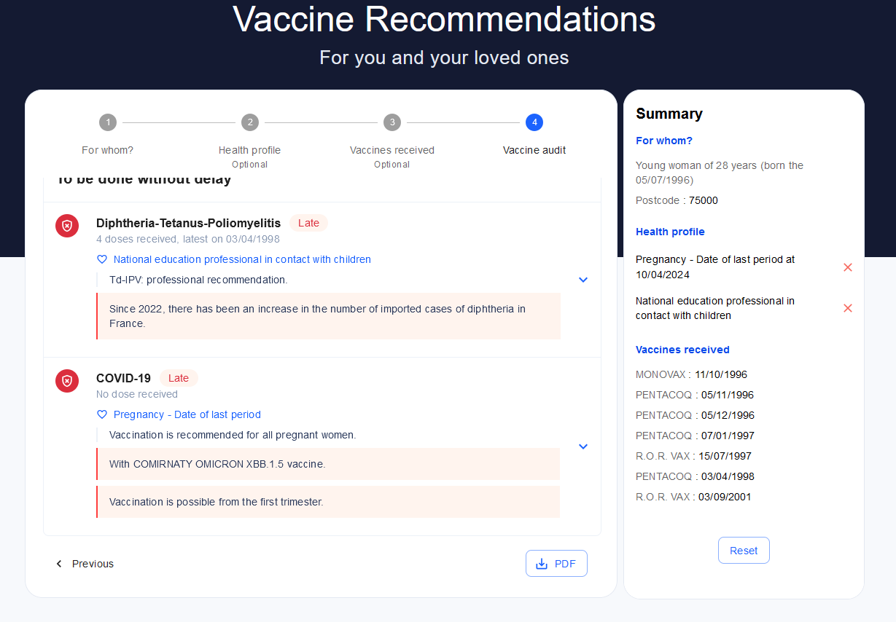
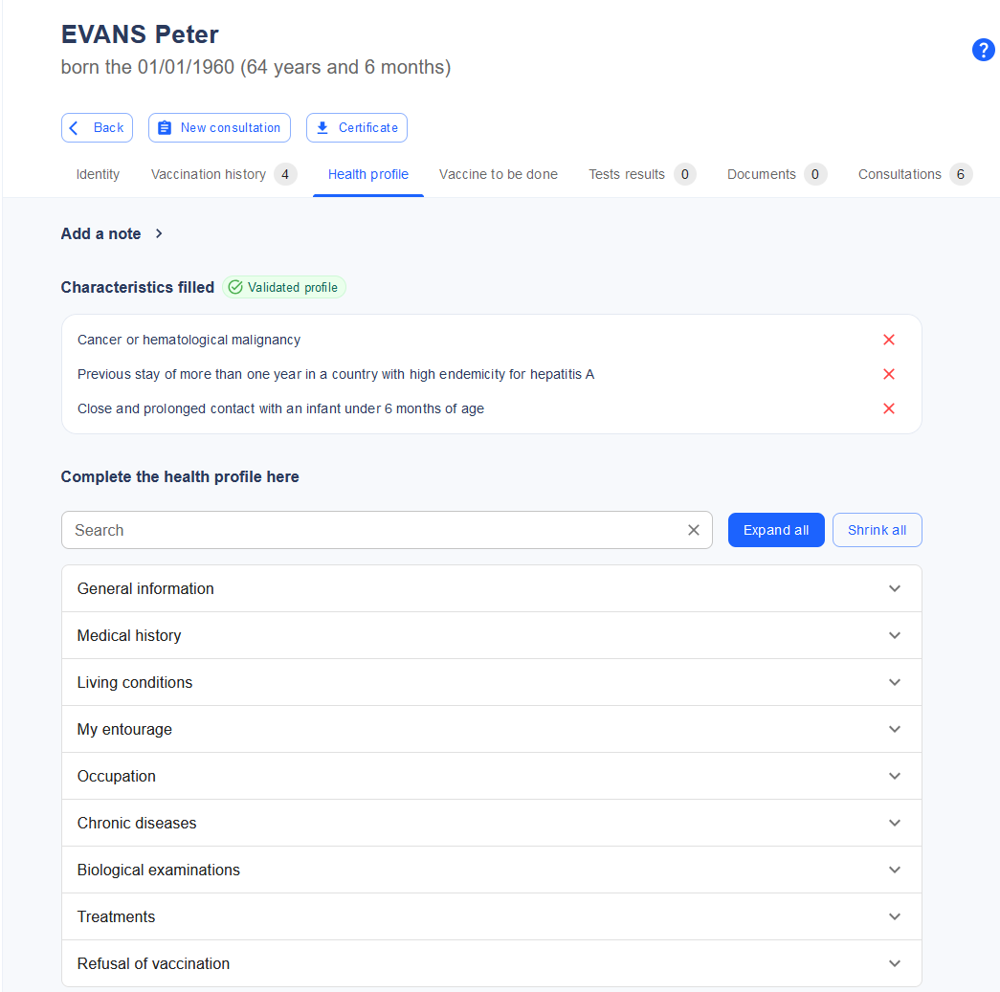
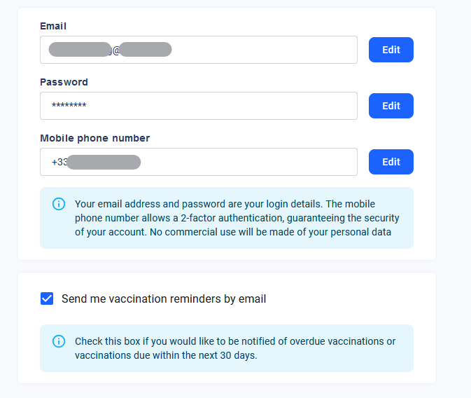
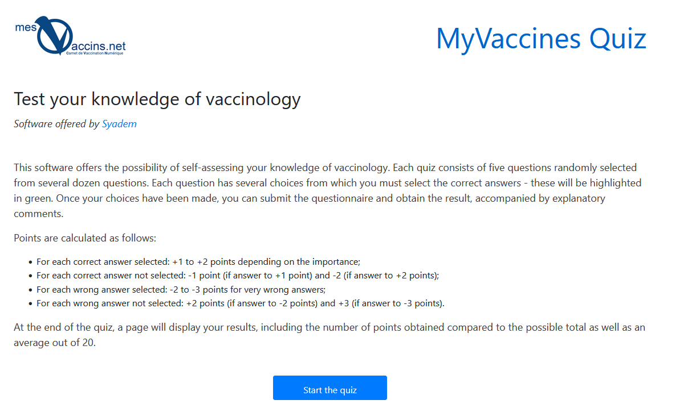

# CLINICAL DECISION SUPPORT SYSTEM (CDS) - FUNCTIONAL DESCRIPTION

| *This module is a functional analysis of the CDS tool with an overview, the stakeholders using or contributing to the use of the tool, their respective functional requirements, the non-functional requirements, and a collection of use cases illustrating the desired functions.* |
|---|

# Description of the tool

*This section provides a functional overview of the intended tool and its usage. It outlines the goals and features without referring to any specific implementation.*

## Objectives

*This section is the overall rationale for the tool.*

The CDS tool delivers personalized immunization recommendations to both citizens and prescribing health professionals. These recommendations are tailored based on individual factors such as health status, age, living conditions, occupation, and intended travel plans.

The tool supports patient adherence by providing detailed, scientifically supported justifications for due vaccinations and helps health professionals in staying updated with the latest recommendations from national or regional health authorities.

When integrated with an Electronic Health Records (EHR) application or an Immunisation Information System (IIS), the CDS can accurately assess the ratio of the population that is protected against vaccine preventable diseases.

## Involved stakeholders and their expectations

*This section outlines the various stakeholders within the implementing Member State who will use or contribute to the tool. Their expectations represent essential requirements for any implementation.* Key stakeholders include:

-   Citizens or their legal guardians
-   Prescribing health professionals
-   National Immunization Technical Advisory Groups (NITAGs)
-   The health authority
-   Implementers of EHR applications or IIS

### Citizens

Citizens seek reliable, clear, and justified vaccination recommendations based on their individual situation in terms of Health, Ageing, Living conditions (including travels) and Occupation (HALO conditions).

The tool must apply the appropriate rules for the citizen’s health jurisdiction, typically based on their place of residence or work, or in some cases, their intended travel destination.

Input of personal data should be quick, straightforward, and guided, while ensuring strong data protection.

Results must be provided in less than two seconds.

### Health professionals

Health professionals share similar expectations with citizens but require more in-depth justifications for the recommendations. Given their time constraints, they expect seamless integration with EHR systems, allowing them to reuse patient data without re-entering it into the CDS tool.

### NITAG

The NITAG expect their recommendations to be easily and promptly transcribed. They need a simple, streamlined process to submit and validate both the transcription of the recommendations and the associated justification messages prior to publication.

### Health authority

The health authority's primary concern is ensuring the CDS service is reliable and available, supported by robust quality processes for both the CDS engine and immunization knowledge digitization. The recommendations provided must clearly distinguish between those endorsed by the health authority and general scientific recommendations.

### Implementers of EHRs

Implementers will require standardized application programming interfaces (APIs), along with robust documentation and reference implementations. Any changes in these interfaces must be well-planned.

Additionally, they must have access to non-production instances of the CDS for testing during development.

The terms of medical responsibility towards their customers must be clearly defined in the contracts.

## Constraints

*Constraints are the non-functional requirements that, while not directly related to the tool's specific functions, are critical to its overall viability.*

### Personal data protection

A CDS tool processes data categorised as special under Article 9 of the General Data Protection Regulation (GDPR). It includes direct health-related data, such as a person’s medical condition (e.g., known diseases) or indirect health-related data (e.g., likelihood of having a disease based on the vaccination history or other relevant factors such as sexual behaviour). Data that do not belong to the special categories but would be considered as sensitive, such as the use of drugs or living in a prison, could also be collected.

Even non-nominative data, like a lifelong vaccination record, could be sufficient for identifying an individual.

Because of this, the CDS falls under Article 9’s regulations on processing personal data for preventive medicine purposes, which is lawful but imposes strict obligations on data processors. These include:

-   Conducting a Data Protection Impact Assessment (Article 35)
-   Ensuring decisions that significantly affect individuals are not based solely on CDS outcomes (Article 22)
-   Appointing a representative within the European Union (Article 27)
-   Designating a Data Protection Officer (Article 37)
-   Documenting all data processing activities, regardless of the size of the entity (Article 30)

### Medical device regulation (MDR)

When used by health professionals to support patient care, the CDS tool qualifies as a medical calculator under the Medical Device Regulation EU 2017/745 (MDR). The Working Group on Borderline and Classification confirmed this in the September 2023 publication of their Manual on borderline and classification for medical devices[^1].

[^1]: <https://health.ec.europa.eu/system/files/2023-09/md_borderline_manual_en.pdf>

The CDS tool’s classification is guided by Rule 11 of Annex VIII of the MDR. While some argue that vaccination decision tools belong in Class I (non-therapeutic), the prevailing consensus is that they should be considered Class IIa devices.

This This classification imposes stringent quality assurance requirements to ensure patient safety and demonstrate compliance throughout the development process, and in the clinical evaluation of benefits.

The CDS tool’s quality assurance process must cover not only the software engine computing the recommendations, but also the medical rule set used to generate recommendations.

### Medical responsibility

The CDS tool is a decision support system, meaning that the ultimate responsibility for vaccination decisions lies with the health professional administering the care. The tool cannot replace the need for proper training by Member State (MS) health authorities, ensuring that professionals can make appropriate vaccination decisions even without the tool or in cases where the CDS recommendations are questionable.

All CDS-generated decisions must be clearly documented and sourced, giving health professionals access to supporting materials such as the product information leaflet (ePIL) or locally endorsed vaccination recommendations.

## Use cases

*The following use cases illustrate how different stakeholders can use the CDS tool to meet their expectations. Each scenario demonstrates a specific function of the tool.*

### UC01-Obtaining a personal recommendation from a questionnaire

Jane, a 35-year-old pregnant schoolteacher in France, wants to know if she needs any vaccines.

She accesses the public CDS interface and completes a questionnaire about her health, occupation, and living conditions. She also inputs her vaccination history, and receives personalized recommendations based on the current national recommendations and programmes.

Figure 1- Questionnaire based recommendation

Since Jane is pregnant, she advised to receive the COVID-19 vaccine and is informed that pertussis vaccination is recommended between the 18th and 34th week of pregnancy. as Additionally, she is advised to get an Influenza vaccine when the flu season starts in October.

Jane also learns she should have received a Diphtheria-Tetanus-Poliomyelitis booster after age 20 due to her work with children.

To confirm her vaccination audit, she can consult her doctor.

*Alternatively, to save the tedious work of entering all of the 23 vaccines she has received so far, she could have uploaded her European Vaccination Card (EVC).*

### UC02-Obtaining a personal recommendation from an EHR application

Dr. Stone, a health professional, meets with her patient Peter.

She opens his medical record and requests a vaccination audit through her medical software. The CDS prepopulates Peter’s conditions from his EHR, and Dr. Stone verifies their accuracy, adding new information (Peter has a 3-month-old granddaughter at home).

The vaccination history is also retrieved from the EHR, and Dr. Stone simply validates the questionnaire to receive the appropriate recommendations.

Figure 2-Questionnaire in an EHR

*The matching of EHR data to the CDS questionnaire can be done dynamically through common representations which could be either semantic (SNOMED-CT or LOINC codes) or structural (fetching from a known structure, such as the MyHealth@EU Patient Summary)*

### UC03 - Obtaining immunization status of a population

A Member State maintains a nationwide Immunization Information System (IIS).

Faced with a resurgence of measles, public health authorities need to assess the risk of an outbreak in different regions.

They use the data linkage tool to gather pseudonymized information from the IIS, tax authority (for household composition), and public health insurance (for health conditions and past infections). This data is submitted to the CDS, and the results are visualized through a geographical information system. This allows authorities to determine vaccine needs by region for the next six months.

### UC04 - Feeding a reminder-recall infrastructure

Jane, a parent, uses the public CDS system to track her son Tom’s vaccination status.

At the time of entering his data, HPV vaccination was not required for boys. However, a new recommendation has been issued advising HPV vaccination for boys aged 11 to 14.

The system regularly recomputes vaccination profiles and detects that Tom will be eligible for HPV vaccination when he turns 11 in two weeks. Based on Jane’s settings, she receives an SMS notification that a vaccination is due soon, prompting her to log in for more details.

Figure 3 - Configuring for reminders

### UC05 - Using the CDS as an educational tool

Tomas, a medical student, is practicing vaccination decision-making as part of his coursework.

He logs into a training platform and is presented with 20 theoretical clinical cases from a database of synthetic or anonymized patient profiles. For each case, Tomas must decide which vaccinations should be administered in the next six months, specifying the timing of each.

The same cases are processed by the CDS, and Tomas’ decisions are compared with the tool’s recommendations. He can see which vaccines he identified correctly, which he missed, and any vaccines he wrongly recommended. Detailed justifications and reference materials are provided for each case, and at the end, Tomas receives a scorecard for self-evaluation.

Figure 4 - Vaccinology quiz

By the end of each sequence, he gets a scorecard for his own evaluation.

### UC06 - Using the CDS to deliver vaccination certificates

Alan is applying for a job on an oil rig, which requires proof of vaccination against certain diseases.

He has a EVC, but the hiring team is not entitled to access his medical data. The employing company has subcontracted a compliance service that exposes a CDS tool with vaccination rules tailored to the job requirements.

Before his job interview, Alan uploads his EVC to the CDS platform and receives a digitally signed compliance certificate, confirming that his vaccinations meet the job requirements. He can present this certificate at his interview without disclosing additional medical information.

*The same method is applicable to any situation where vaccination status is required for “administrative” purposes (according to the Medical/Administrative/Personal mapping used throughout the Vaccines-EU study[^2]).*

[^2]: <https://data.europa.eu/doi/10.2925/236134>
