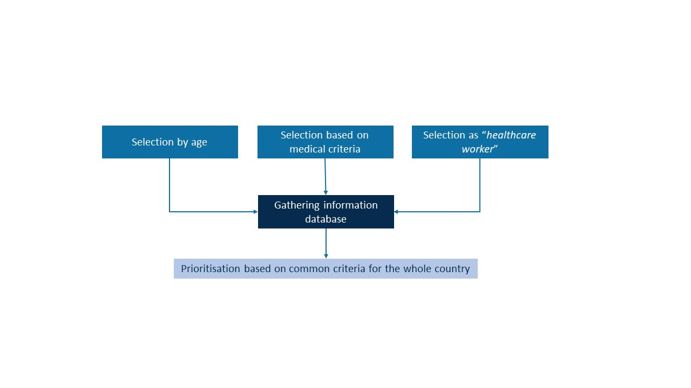

# DATA LINKAGE PROCESS - FUNCTIONAL DESCRIPTION

*This section provides a functional overview of the intended tool and its usage. It outlines the goals and features without referring to any specific implementation.*

*This implementation plan refers only to individual data linkage. Other types of data linkage are not covered by the several chapters of this implementation plan.*

## Objectives

*This section is the overall rationale for the tool.*

Data linkage is a method that brings together information that relates to the same individual, family, place or event from different data sources. Individual data linkage refers to the process of connecting individual-level information stored across several pre-existing data sources for defined public-health purposes. In the context of vaccination, it can support several applications in both routine immunisation programmes or public-health emergencies/crisis context.

The data linkage process can support:

-   The screening of the population based on specific health and demographic criteria to issue priority vaccination invitations. This process ensures that individuals who are defined at higher risk receive timely notifications and invitations to get vaccinated.
-   The monitoring of the pillars of vaccination surveillance (coverage of specific target populations (e.g. healthcare workers), effectiveness and safety). By keeping track of these elements, health authorities can ensure the effective monitoring of the vaccination campaign and make data-driven adaptations in the strategy where necessary.

## Involved stakeholders and their expectations

*This section outlines the various stakeholders within the implementing Member State who will use or contribute to the tool. Their expectations represent essential requirements for any implementation.*

Key stakeholders include:

-   Health authorities
-   Database owners
-   Trusted third party
-   Legal authorities
-   Database manager
-   Data analysts
-   Citizens

The stakeholders and their roles may vary depending on the context and environment in which data linkage is implemented. The descriptions below are based on the Belgian context. The roles and responsibilities of each party involved in implementing the data linkage process must be clearly defined.

### Health authorities

Health authorities are the entities responsible for vaccination policy and/or the implementation of vaccination campaigns at either the national or local level, depending on how vaccination policies are governed in a given country.

Health authorities aim to ensure a safe and effective implementation of vaccination policies, for routine immunisation programmes or targeted campaigns in a crisis context. To assess the efficiency and accuracy of these efforts, health authorities require precise and detailed monitoring of different components of a vaccination roll-out, their progression, and the evaluation of the impact and outcomes of vaccination.

Health authorities are responsible for defining vaccination strategies and, by extension, identifying and inviting the appropriate individuals at the right time according to pre-defined criteria.

As such, they rely on information that can help support vaccination planning, help determine priority populations and improve public health communication strategies. In this context, data linkage processes provide outputs that inform and support strategic decision-making.

### Database owners

Database owners (e.g., hospitals, national registries, or private providers) are the custodians that hold one or several dataset(s) which can be linked together thanks to a common identifier, and upon which the analyses are based. Their role is to ensure the data they provide is accurate and complete. In case a common identifier does not exist, probabilistic linkage (i.e. on the basis of a combination of variables that appear in multiple datasets, such as gender, postal code and date of birth).

Database owners require a legal framework that ensures and permits the transfer of their data, as well as clear guidelines on data handling responsibilities and protocols. They expect a secure and robust data exchange. Additionally, a financial compensation is expected for their involvement, to support the provision and maintenance of the services, as this will require staff time from the side of the database owner.

### Trusted third party

A Trusted third party (TTP) is a neutral intermediary that manages direct and indirect identification data to perform pseudonymisation (generating and assigning unique, non-identifiable pseudonyms for the same individual across datasets, which is then used to connect the different datasets). This enables secure data linkage by database managers without exposing original identifiers. They are expected to maintain strict confidentiality, ensures security, data protection, and ethical compliance, avoid conflicts of interest, and provide audit trails to demonstrate the security of the linkage process.

Trusted third parties require legal authorisation in order to process and handle data. They aim to set up a solid data flow and guarantee the reliability and security of data exchange.

### Legal authorities

Data protection authorities are the legal authorities responsible for approving data linkage requests, according to a certain need. They require full compliance with the General Data Protection Regulation (GDPR)[^1] and all relevant national legislations and regulations. They are expected to review data-sharing agreements, consent mechanisms, and risk assessments to mitigate legal and ethical risks. Legal authorities should provide clear guidance on permissible uses of data and safeguarding both individual rights and public interests.

[^1]: [*Regulation (EU) 2016/679 of the European Parliament and of the Council of 27 April 2016 on the protection of natural persons with regard to the processing of personal data and on the free movement of such data, and repealing Directive 95/46/EC (General Data Protection Regulation) (Text with EEA relevance.)*](https://eur-lex.europa.eu/legal-content/EN/TXT/?uri=CELEX%3A32016R0679)*.*

    [*Regulation (EU) 2018/1725 of the European Parliament and of the Council of 23 October 2018 on the protection of natural persons with regard to the processing of personal data by the Union institutions, bodies, offices and agencies and on the free movement of such data, and repealing Regulation (EC) No 45/2001 and Decision No 1247/2002/EC (Text with EEA relevance.)*](https://eur-lex.europa.eu/legal-content/EN/TXT/?uri=celex%3A32018R1725)*.*

Another legal authority involved in data linkage is the ethics committee. The role of the ethics committee is to ensure that the rights, safety and well-being of those involved are protected.

### Database managers

Database managers are responsible for the technical and operational aspects of the datasets. Their role includes preparing data for linkage (e.g., cleaning, standardizing formats), managing access permissions, troubleshooting technical issues, and performing the actual linkage.

### Data analysts

Data analysts and epidemiologists are the authorised personnel to perform the analysis on the linked data (e.g. data scientists, statisticians, epidemiologists, researchers in public health, etc.).

They are responsible for translating results into clear evidence and reports. Those productions support health authorities to plan, organise and adjust vaccinations strategies.

### Citizens

Citizens should be informed, alerted and recommended vaccinations against diseases they are defined as the most at risk for, and about the usefulness to be vaccinated. They expect to receive a relevant and timely invitation/notification for vaccination. Additionally, they should be aware on the purpose of the linkage, how their data is being used, what their rights are, what information is being collected, who will process their data. They should be informed through an information letter and have access to publications/reports built using their data. They expect that their data are processed securely, and their privacy is guaranteed.

## Constraints

*Constraints are the non-functional requirements that, while not directly related to the tool's specific functions, are critical to its overall viability.*

**Availability of databases and data quality**

The number and diversity of relevant databases define the data linkage range of applications. The quality of the data will determine the performance of the linkage tool. The quality can be split up in various criteria, including:

-   **Completeness**: ensuring that all relevant data are completely filled in; e.g., “*is the date of vaccine administration recorded for all vaccinated persons?*”.
-   **Conformance**: refers to the extent in which the data values adhere to specified standards and formats (i.e. data values comply with permitted values or ranges; e.g., sex only has the values “*Male*”, “*Female*” or “*Unknown*”; age is a natural number and is in a specified range).
-   **Consistency**: this is the uniformity, coherence, and lack of contradiction in data across multiple datasets. It ensures that the same information (e.g., a persons’ age) is represented identically across all databases.
-   **Plausibility**: checks whether data values are believable, i.e. there is a plausible sequence of events and relationships between values; e.g., vaccine administration dates falling before the first vaccine administered in country.
-   **Representativeness**: the extent to which the study population is representative for the target population (e.g., *do they reflect the population breakdown of the country in terms of sex, age, geographical location?*).

**IT infrastructure**

The performance of the linkage tool is dependent on the performance of the IT infrastructure. It directly impacts the capacity to provide real-time insight and accurate, continuous monitoring. Several aspects should be considered.

-   **Timeliness:** *the frequency and the speed of the data transfers.*
-   **Automation:** *minimizes manual intervention and efforts for repetitive tasks ensuring efficiency and consistency.*
-   **Scalability:** *the capacity to accommodate changes in the volumes and structures of data, as well as an increased workload.*
-   **Interoperability:** *supports standards data formats and protocols for data exchange.*
-   **User-friendliness:** *this facilitates both the data linkage and the data analyses.*

**Multidisciplinary team**

For the optimal utilisation of the processed data, a collaboration is required between data scientists and public health experts. The first will extract, prepare, and analyse the data while the second will work on study design, preparing an analysis plan, interpreting the results, and translating it in real-world recommendations.

**Available funding**

Adequate funding is necessary for the resources (data acquisition, infrastructure, technology, personnel and expertise) required for developing and maintaining the system. Sufficient funding is essential for the initial development and implementation phases, ensuring the system is built to meet the required specifications. Ongoing funding is required to maintain the system, implement new tools, perform data updates and keep the system secure, efficient and up to date.

**Culture of data-driven policies among the stakeholders**

Data-driven culture among stakeholders impacts the willingness and ability of stakeholders to effectively implement and utilise the data linkage process. A supportive culture is necessary to ensure that the linked data is actively used for policy- and decision-making processes. Without this cultural foundation, the data linkage process may not achieve its intended impact. Stakeholders who value data-driven insights are more likely to prioritise and invest in the necessary infrastructure, training, and resources needed to implement and sustain a data linkage process. More specifically, participation and contribution to the European Health Data Space (EHDS) ecosystem will facilitate implementation of the linkage tool.

**Institutional trustworthiness regarding (health) data**

The acceptability of the tool depends on citizen confidence that government and other stakeholders will act in their best interests. If public opinion on the tool is positive, there is more willingness to share personal data, and more acceptance of communication regarding outputs. All involved stakeholders should adopt a conduct promoting citizen's acceptance of health data sharing, linkage, and reuse, as well as adhesion to the resulting decisions and communication.

Behaviours fostering trust are competency (demonstrating expertise and knowledge) transparency (being open and honest on operations and decisions), and fairness.

A practical application is effort in the protection of sensitive personal data: protection measure, effective risk management, compliance with standards, etc. In addition, there should be clear and transparent communication about this to the general public.

**Computer literacy and knowledge on privacy rules among HCW**

For the data linkage process to be used effectively, healthcare workers should have a basic level of computer literacy to interact with their recording/reporting system (primary data collection system). A lack of computer literacy can lead to user errors, data entry mistakes, and improper use of the system, which can compromise the integrity and accuracy of the linked data. The system may not be usable, regardless of its technical capabilities. Healthcare workers with adequate computer skills can use the system more efficiently and are more prone to accept and use the system.

As they are working with personal and sensitive (medical) data, it is also essential that HCW have some knowledge on privacy regulations, such as the General Data Protection Regulation (GDPR). This can be accommodated by following (online) trainings related to this topic, organised by a data protection authority.

## Use cases

*The following use cases illustrate how different stakeholders can use the data linkage process to meet their expectations. Each scenario demonstrates a specific function of the tool.*

### Vaccination surveillance

Post-authorisation vaccine surveillance consists of monitoring various outcomes related to the vaccine. It is used to inform policy decisions, optimise vaccination strategies and allocate resources effectively to improve overall public health outcomes.

The healthcare sector is an information-intensive environment, where the transmission of information can be altered in the event of overload, such as during a public health emergency or the introduction of new vaccine.

Establishing a link between the national vaccination registers and existing databases of national health registers, all of which contain a national UPI, aims to create a prospective cohort of vaccinated people. The data linkage of pre-collected data avoids the need to set up a new prospective data collection system, which add to the burden already imposed on healthcare staff. Such linkage make it possible to monitor vaccination coverage, safety, and effectiveness among the general population as well as in specific subgroups (e.g. elderly people, healthcare workers, nursing home residents, etc.).

Potential data sources linked to vaccination registry and output associated:

| DATA SOURCE                                            | (POSSIBLE) CONTENT                                                                                                                                                                    | OUTPUT                                                                                                                                                                                               |
|--------------------------------------------------------|---------------------------------------------------------------------------------------------------------------------------------------------------------------------------------------|------------------------------------------------------------------------------------------------------------------------------------------------------------------------------------------------------|
| Laboratory test results database                       | Data on tested patients Information on test prescriptions, test results (including rapid tests), symptoms, variant, suspected false negatives and false positives                  | Identification of breakthrough cases Estimation of **vaccine effectiveness against symptomatic infection**                                                                                        |
| Hospitals clinical database                            | Data on hospitalised patients (e.g. comorbidities, symptoms, complications, length of stay, treatments, outcome of hospitalisation, entry and discharge of intensive care unit, etc.) | Identification and characterisation of hospitalised breakthrough cases Estimation of **vaccine effectiveness against hospitalisation**                                                            |
| Healthcare professional database                       | Data allowing identification of healthcare workers (HCWs)                                                                                                                             | Determination of **vaccination coverage among healthcare workers**                                                                                                                                   |
| National statistics databases                          | Socio-economic information (family composition, nationality/origin, employment status, income, …)                                                                                  | Differences in **vaccine uptake by:**  **Underlying conditions** **Socio-economic status** **Socio-demographic groups**   Confounders for **vaccine effectiveness** calculations   |
| Insurance databases  (Care reimbursement databases) | Data on reimbursed care and medicines of citizens insured in the country (e.g. pseudo-pathologies as comorbidities, nursing home resident status, medications, etc.)               |                                                                                                                                                                                                      |

The different information collected and analysed through the linkage of databases can be used for infographics or communication support for stakeholders involved in policy decisions, as well as for the general population, regarding the almost real-time vaccination coverage during a vaccination campaigns, the effectiveness of the vaccines administered.

### Screening for vaccination invitation

Vaccination requires preparation in order to target the people for whom vaccination is the most necessary or effective (specific to an age group, medical condition, profession, risk of exposure, etc.).

Linkage of existing databases can help to identify individual for an invitation for vaccination based on chosen characteristics and ensure the protection of those in need.

An extension of this is the ability to track among the target population who has not yet been vaccinated, despite having received an invitation, by linking the vaccine register with nominative information. This allows for the sending of personalised reminders.

Example of screening for priority invitation for vaccination based on specific characteristics.

For disease X, a vaccine is available, and the complete population is eligible to get vaccinated. However, certain categories of people have been identified by the national authority as prioritised for vaccination:

-   Individuals presenting certain underlying medical conditions, identified with an increased risk of severe complication in case of infection.
-   Healthcare workers, identified with an increased risk due to close exposure to patients.
-   Older age groups.

‘*Selection’* means that a person is selected according to a prioritisation on the basis of established criteria to be allowed to be vaccinated from a certain moment.

Medical prioritisation criteria have been established by national authorities and individuals have been selected either centralised within the healthcare insurances (public (social security) or private insurances) databases or decentralised through the Electronic Health Record by their general practitioners or specialists. Data allowing identification of healthcare workers are registered in a dedicated HCW database. Individual identification information, from which the date of birth is extracted for age selection, is recorded in a national citizen register.

A dedicated environment is created to host the linkage and the screening procedure. The different databases go through the TTP for the pseudonymisation procedure using deterministic encryption, before being imported in this environment. The linkage is thus performed based on the pseudo-UPI. Based on the vaccination recommendations, the priority patients are flagged. Those who died or are already vaccinated are filtered out and a list of pseudo-UPI is extracted.

The deterministic encryption makes it possible to send this list back to the TTP for de-pseudonymisation. Thanks to this process, the competent authorities is able to contact the prioritised patients without ever knowing the reason of prioritisation, thus protecting their privacy.

**

Figure 1. Example of the process of the selection of individual based on specific characteristics for invitation/notification to priority vaccination.
