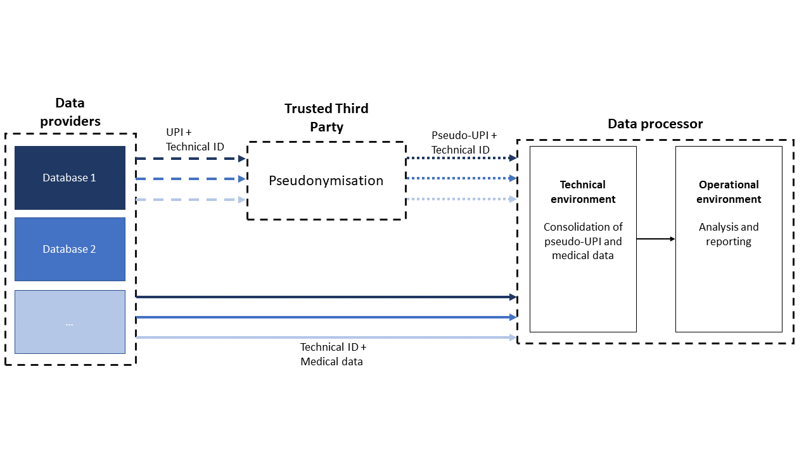

# DATA LINKAGE PROCESS - SECURITY AND PRIVACY

# Purpose

This document provides the necessary information for a data protection officer to assess the adequacy of a data linkage implementation with the requirements of the GDPR or any equivalent regulation for the protection of personal data.

*It relies upon the data linkage architecture hypotheses that are documented in Module 08 - Architecture. For implementations that would deviate from these hypotheses, an alternative data flow would need to be developed.*

# Characterization of the processing

## Purpose of processing

The implementation of a linkage process relies on the use of individual-level data, which poses a significant risk to data security if appropriate standards are not met. In such cases, data linkage should not be implemented. The purpose of data linkage is to integrate a minimum of two data sources from pre-existing registers or databases, thereby reducing the need for new data collections. Data linkage can serve different purposes, as defined in Module 02 - *Functional description*.

## Responsibilities

Data controller and processor roles depend on the structure of the data linkage that is expected to be implemented. The data controller is the entity determining the purposes and means of processing personal data. Commonly, the organisation or entity willing to implement the data linkage process, and if existing, the DPO associated with it, acts as the data controller, responsible for ensuring compliance with GDPR and national laws. The technical part can be delegated to IT experts from different entities, and is under the responsibility of the data processor, responsible for implementing encryption, access controls, and/or logging mechanisms. The data processor can be acting on the behalf of the data controller.

The motivations and objectives of the data linkage, as well as the evaluation of a research project, should also be discussed within a decision board (which could include representatives of the different database owners). Although the decision board does not include direct representatives of data subjects, the database owners act not only in the interests of their respective organisations but also as stewards of the data entrusted to them. They have a responsibility to safeguard the interests, privacy, and security of the individuals whose data they hold. In this role, they should ensure that the proposed data linkage is necessary, proportionate, aligned with the original purposes for which the data were collected, and conducted in a manner that adequately protects the rights of the individuals concerned.

## Data subjects

Data linkage is only applied to data contained in databases or registers for which data sharing has been agreed. The GDPR grants individuals whose data is processed the right of access, rectification, removal, restriction and objection. The implementers will only be able to respond to requests concerning these rights if it is possible to make the connection between the data and the applicant. In the case of pseudonymised data, it should not be possible to determine which data belongs to which individual. In order to link the data to the applicant, the implementer would therefore need to obtain additional information from the applicant.

## Nature of data

The nature of the processed data varies depending on the purpose of the data linkage and the content of the databases authorised for sharing, as set out in the detailed protocol. Data linkage may involve data of different natures (e.g. in Module 09 *- Data*).

## Lifecycle of data

Figure 1 - Lifecycle of data

Once the analysis has been carried out, in accordance with the GDPR, personal data may not be retained for longer than is necessary to fulfil the purposes for which it is processed. The retention period and the data disposal procedure (deletion, aggregation, etc.) are determined by the data controller, based on the purpose of the processing and the authorisations of the national data protection authorities (*3.5 Retention of data*).

# Liceity of processing

## Legal basis

As identified in Module 04 - *Prerequisites*, the implementation of the data linkage process must have a valid legal basis complying with all applicable national and European legal frameworks. A specific set of laws, regulations (GDPR, national, regional and/or local laws) mandates and guidelines must be in place to address circumstances such as :

-   data sharing,
-   secondary use of data, and,
-   processing individual health-related data.

This set of legal elements should ensure that any action taken in relation with the development, implementation and use of data linkage are secure, regulatory and ethically-compliant.

## Transparency of purpose

Following the pre-requisites defined in Module 04, [GDPR Art. 12](https://gdpr-info.eu/art-12-gdpr/) for transparent information, communication and modalities for the exercise of the rights of the data subject, [Art. 13](https://gdpr-info.eu/art-13-gdpr/) for information to be provided where personal data are collected from the data subject, or [Art. 14](https://gdpr-info.eu/art-14-gdpr/) for information to be provided where personal data have not been obtained from the data subject.

Depending on the legal context of the data linkage, the controller must take appropriate measures to provide any information referred to in Art.13 and 14, relating to processing the data subject in a concise, transparent, intelligible and easily accessible form. The information shall be provided in writing, or by other means, including by electronic means (e.g. informed consent form, information letter for participants).

Following GDPR Art.13 and 14, ‘the controller shall, […] provide the data subject with all of the following information:

-   the identity and the contact details of the controller and, where applicable, of the controller’s representative.
-   the contact details of the data protection officer, where applicable.
-   the purposes of the processing for which the personal data are intended as well as the legal basis for the processing.
-   where the processing is based on point (f) of [Art. 6](https://gdpr-info.eu/art-6-gdpr/)(1), the legitimate interests pursued by the controller or by a third party.
-   the recipients or categories of recipients of the personal data, if any.
-   the categories of personal data concerned (only if personal data have not been obtained from the data subject)
-   where applicable, the fact that the controller intends to transfer personal data to a third country or international organisation and the existence or absence of an adequacy decision by the Commission. […]’

‘In addition to the information referred [*to in paragraph 1*] above, the controller shall provide the data subject with the following further information necessary to ensure fair and transparent processing:

-   the period for which the personal data will be stored, or if that is not possible, the criteria used to determine that period.
-   the existence of the right to request from the controller access to and rectification or erasure of personal data or restriction of processing concerning the data subject or to object to processing as well as the right to data portability.
-   where the processing is based on point (a) of [Art. 6](https://gdpr-info.eu/art-6-gdpr/)(1) or point (a) of [Art.9](https://gdpr-info.eu/art-9-gdpr/)(2), the existence of the right to withdraw consent at any time, without affecting the lawfulness of processing based on consent before its withdrawal.
-   the right to lodge a complaint with a supervisory authority.
-   from which source the personal data originate, and if applicable, whether it came from publicly accessible sources (only if personal data have not been obtained from the data subject)
-   the existence of automated decision-making, including profiling, referred to in [Art. 22](https://gdpr-info.eu/art-22-gdpr/)(1) and (4) and, at least in those cases, meaningful information about the logic involved, as well as the significance and the envisaged consequences of such processing for the data subject.

Where the controller intends to further process the personal data for a purpose other than that for which the personal data were collected, the controller shall provide the data subject prior to that further processing with information on that other purpose and with any relevant further information [*as referred to in paragraph 2*]’.

Where personal data relating to a data subject are collected from the data subject, the controller shall provide the data subject with all of previously mentioned information at the time when the personal data are obtained.

GDPR [Art.15](https://gdpr-info.eu/art-15-gdpr/) to 22 grant individuals whose data is processed the right of access, rectification, erasure, restriction and objection. The controller is responsible for facilitating the exercise of data subject rights, unless the controller demonstrates that it is not in a position to identify the data subject.

## Proportionality / Minimisation of data

GDPR requires that only necessary data be processed. Depending on the content of the various databases concerned by the data linkage, the GDPR’s data minimisation principle (point (c) Art.5) must be adhered to and discussed between the various parties, whilst ensuring that the objectives defined by the protocol can be achieved. Only specific data fields from the databases can be included in the linkage to guarantee this principle.

A Disclosure Risk Assessment (DRA)[^1] is a method used in data anonymisation to support the principle of data minimisation (DRA is not mentioned in GDPR). Its goal is to reduce the risk of re-identifying individuals in datasets while preserving the utility of the data for analysis.

[^1]: A Disclosure Risk Assessment is generally expected for data linkage involving individual data, especially when personal or sensitive data are linked or shared, and in some settings it is mandatory required by institutional or legal governance (where it may be designated by a local name; the term ‘Small Cell Risk Analysis (SCRA)’ is used in Belgium. A Disclosure Risk Assessment should be regarded as a standard privacy protection measure rather than as an additional option.

The DRA identifies high-risk data elements by focusing on data fields that, alone or in combination, could uniquely identify individuals (such as birthdates, postal codes, or rare disease codes), which if linked to external information can re-identify someone. The DRA assesses re-identification risk by evaluating how likely it is that an individual could be re-identified from the dataset, especially in small groups (or "*small cells*") where unique combinations of attributes make individuals stand out.

This assessment supports the evaluation of the balance between risk and utility, where it is determined whether the benefit of including certain data (for research, statistics, or public health) outweighs the privacy risk. If the risk is too high, the data may be:

-   Generalised (e.g., replacing exact birthdates with age ranges).
-   Suppressed (e.g., removing rare or unique values).
-   Aggregated (e.g., combining small groups into larger categories).

Commonly, data referring to 5 or less individuals (‘*Rule of 5’[^2]*) are required an anonymisation process.

[^2]: The ‘*Rule of 5*’ is a threshold-based technique used to prevent re-identification. It dictates that data for any given demographic or identifying combination must belong to at least 5 individuals. If fewer than 5 people fall into a group (or if an individual can be singled out), that data must be masked, suppressed, or aggregated to prevent re-identification. A dataset may only be made public or shared if it represents at least five unique entities, sources or individuals.

    [Anonymization Primer: Risk Thresholds for Patient Re-identification - Real Life Sciences](https://rlsciences.com/risk-thresholds-for-patient-re-identification/)

Additionally, as data linkage processes individual-level data, a pseudonymisation step is mandatory if direct identifiers would otherwise be included in the linkage.

## Accuracy of data

Automated or manual data validation checks and data cleaning processes can be defined to ensure data accuracy. Procedures and processes can be defined before and after the linkage to maximize accuracy, minimize errors, and maintain data integrity.

Before the data linkage, several processes can be put in place on the ‘raw’ datasets to ensure accuracy and reliability. These include:

-   **Data preparation and cleaning** which can include:
    -   Standardisation (ensuring consistent formats)
    -   Deduplication (identifying and removing duplicate records)
    -   Handling missing data (clear strategies for addressing missing values, such as imputation, flagging, or exclusion, depending on the context and impact on linkage quality)
    -   Normalisation process (converting data into common scale or structure)
-   **Data quality assessment**, for which criteria have been defined in Module 02 - *Functional description* (*Constraints*) and may involve checking for:
    -   Completeness (ensuring all required fields are populated)
    -   Conformance (validating data against known ranges or rules)
    -   Consistency (verifying logical coherence, uniformity, and lack of contradiction in data across multiple datasets).
    -   Plausibility (verifying that data values are believable)
    -   Representativeness (verifying that study population is representative for the target population)

Pilot testing can be conducted with a small-scale linkage test to identify potential issues (e.g., false matches, missed links) and refine the matching strategy.

Quality of the linked data can also be evaluated through different means:

-   **Quality control checks**, which can include:
    -   Plausibility checks (identifying implausible scenarios in the linked dataset)
    -   Temporal consistency (ensuring linked records align logically in time)
-   **Match rate** (calculating the proportion of records successfully linked (true matches) and assessing the impact of unlinked records on the analysis)
-   **Comparison of characteristics of linked and unlinked data** (assessing potential biases by comparing demographics, clinical characteristics, or other key variables between linked and unlinked records. This helps identify systematic differences that could affect the representativeness of the linked dataset.)

## Retention of data

The GDPR does not set a universal maximum or minimum period for the retention of personal data. However, it lays down two key principles:

1.  **Principle of data retention limitation** (Art. 5(1)(e) of the GDPR)

Personal data, even pseudonymised, must be kept in a secure environment for no longer than is necessary for the purposes for which the data are processed. Data may be deleted or anonymised as soon as it is no longer necessary for the original purpose. The retention period depends on the purpose of the processing and the recommendations from national data protection authorities.

2.  **Obligations under the data controller**

The data controller is required to set a retention period, which must be justified by the purpose of the processing and documented in the Record of processing activities (Art. 30 of the GDPR), and if necessary in the Data Protection Impact Assessment (DPIA) (Art. 35). The controller shall be responsible for, and be able to demonstrate compliance with all principle of GDPR Art.5. Individuals concerned by the use of their data must be clearly informed of the retention period and the retention policies in the privacy notice (Art. 13) or when collecting data (Art.14).

If the data linkage process required an approval from the Data Protection Authorities, the retention period for pseudonymised data depends on the period specified in the approval from the national information security authority.

The same applies to the retention of the UPI and pseudonymised identifiers by the TTP.

# Risk management

## Evaluation of risk level

As data linkage is considered as ‘*high-risk processing’*, a DPIA must be carried out by the data controller or its DPO, before any processing of personal data begins, to assess and mitigate risks to the rights and freedoms of persons.

The DPIA must report:

-   A detailed description of the processing (purpose, nature of the data, categories of data subjects, recipients).
-   An assessment of the risks to individuals’ rights and freedoms.
-   The measures envisaged to mitigate these risks (technical and organisational measures).
-   Justification of the necessity and proportionality of the processing.

National Data Protection Authorities may publish lists of processing operations requiring a DPIA. The [European Data Protection Board](https://www.edpb.europa.eu/sme-data-protection-guide/data-protection-basics_en) has established nine criteria to help identify high-risk processing operations. If at least two criteria are met, a DPIA is generally required[^3].

[^3]: [*THE EDPB’S 9 CRITERIA FOR DPIAS (.pdf) - European Data Protection Board* ](https://keepabl.com/wp-content/uploads/2025/03/The-EDPBs-9-DPIA-Criteria-Keepabl-Infographic.pdf)

## Mitigation measures

Based on the different purposes of data linkage, different risks might be mitigated and reported in the DPIA. The DPIA should include the specific measures to mitigate risks and the procedures for incident responses.

Within data linkage, common mitigation measures encompass:

-   **Pseudonymisation**: direct identifiers are replaced with unique pseudonyms.
-   **Encryption**: data is encrypted.
-   **Access Controls**: only authorised personnel can access the data through multi-factor authentication or role-based permissions.
-   **Audits**: all actions are tracked (who accessed what, when, and why) with immutable logs and versioning of datasets.
-   **Separation of environments**: isolation of staging, linkage, validation and analysis environments to prevent data leakage.
-   **Incident response plan**: breaches are detected via automated monitoring, reported to the DPA and remediated according to a previously defined plan.
