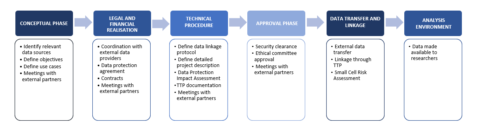

# DATA LINKAGE PROCESS - DEPLOYMENT

# Project team

Setting up and then exploiting the data linkage requires experts with competencies in IT, data science, health / epidemiology, as well as a data protection officer (DPO) with solid understanding of GDPR and national / local rules. General and comprehensive awareness about the European Health Data Space (EHDS) can help. The first step is to draw up an agreement on the objectives of the data linkage and the way to meet those. In practice, it could mean reaching a compromise between the legal and technical constraints, and the ideal needs in terms of health surveillance. To do so, experts from each field will collaborate in an iterative process:

-   Health / epidemiology experts identify the needs to be met by the linkage, inventory the data required to do so, and compare it to the existing resources.
-   Legal experts and DPO ensure compliance with the legal framework and establish guidelines in terms of data protection.
-   IT experts offer guidance on the technologies and resources that meet the information needs of the linkage, the protection regulations, and the security of the data.

Once the agreement is reached, the IT professional can start to set up the technical infrastructure bringing all the data together. When it is up and running, the data scientists and epidemiologists collaborate to analyse the data and derive surveillance indicators, recommendations, and scientific knowledge from it.

All parties remain in collaboration during the process to assess and answer to new use cases.

# Workflow

-   Identify the relevant datasets and ensure their interoperability (data format compatibility, data standardisation formats used and semantic interoperability).
-   Once interoperability is assessed, define a detailed protocol and description for a secure and pseudonymised data transfer, which safeguards the data during transmission and maintains privacy.
-   Datasets are gradually added to the data flow, allowing for a phased integration process.
-   As datasets are incorporated, indicators of data quality (e.g. plausibility, completeness conformance, timeliness and representativeness) and the robustness of the automated processes (e.g. % of successful transfer,% of records transmitted, comparison of aggregated values between the original database and data in the operational environment) are monitored.
-   Once the data flow is established, continuous maintenance is performed to ensure smooth operation, data are made available for use.
-   Effective communication of the data is maintained to ensure that relevant stakeholders are informed and engaged.
-   Training and capacity building activities are provided to relevant stakeholders to ensure appropriate use of the system.

# Typical planning

Figure 1. Steps for the implementation and use of data linkage.

**Data Protection Impact Assessment (DPIA)** *is a systematic assessment of the risks to individuals’ rights and freedoms, carried out prior to any processing of personal data that is likely to result in a high risk (e.g. sensitive data, mass surveillance, automated decision-making). It enables risks to be identified, measures to mitigate them to be proposed, and compliance with the GDPR (Art. 35) to be demonstrated. (Further information are available in Module 10 – Security and privacy).*

**Security clearance** *refers to the formal authorisation allowing access to classified or restricted information, following a background check. It is the process of* *regulating the secure processing and exchange of personal data within public administrations, healthcare, and social security. Specific organisations are in place to oversees data sharing to protect citizen privacy. The exact mandate differs by country, but clearance from such a committee could be required in order to proceed with data linkage.*

**Small Cell Risk Assessment (SCRA)** *is the process of evaluating the potential risk of re-identifying individuals within a dataset, particularly when dealing with small populations and/or high granularity. This risk arises when data is aggregated or presented in a way that small groups (or "small cells") contain very few individuals, making it easier to deduce their identities. SCRA is crucial to protect individual privacy, especially if the dataset contains sensitive information such as health or demographic data. Conducting a SCRA before making data available in an analysis environment ensures that individual privacy is preserved, sensitive data is protected, and legal obligations are met, all while maintaining the data’s usefulness for operational purposes.*

| **Task**                                  | **M1** | **M2** | **M3** | **M4** | **M5** | **M6** |
|-------------------------------------------|--------|--------|--------|--------|--------|--------|
| **Conceptual phase**                      |        |        |        |        |        |        |
| Identify relevant data sources            | X      |        |        |        |        |        |
| Define objective(s)                       | X      |        |        |        |        |        |
| Define use case(s)                        | X      |        |        |        |        |        |
| **Legal and Financial realisation**       |        |        |        |        |        |        |
| Coordination with external data providers |        | X      | X      |        |        |        |
| Data protection agreement                 |        | X      | X      |        |        |        |
| Contracts                                 |        | X      | X      |        |        |        |
| **Technical procedure**                   |        |        |        |        |        |        |
| Define data linkage protocol              |        | X      | X      |        |        |        |
| Define detailed project description       |        | X      | X      |        |        |        |
| Data Protection Impact Assessment         |        | X      | X      |        |        |        |
| Trusted Third Party documentation         |        | X      | X      |        |        |        |
| **Approval phase**                        |        |        |        |        |        |        |
| Security clearance                        |        | X      |        |        |        |        |
| Ethical committee approval                |        | X      |        |        |        |        |
| **Data transfer and linkage**             |        |        |        |        |        |        |
| External data transfer                    |        |        | X      | X      | X      | X      |
| Linkage through Trusted Third Party       |        |        | X      | X      | X      | X      |
| Small Cell Risk Assessment                |        |        | X      | X      | X      | X      |
| **Analysis environment**                  |        |        |        |        |        |        |
| Data available to researcher              |        |        |        | X      | X      | X      |

# Build resources

List of useful tools:

-   Protocol/software for data transfer
-   Protocol/software for pseudonymisation
-   Protocol/software for data storage
-   Protocol/software for operational environment access
-   [*Citrix Gateway*](https://docs.citrix.com/en-us/citrix-gateway.html)
-   Protocol/software for data analysis/management
-   [*SAS Enterprise Guide*](https://www.sas.com/en_us/software/enterprise-guide.html)
-   [*R*](https://www.r-project.org/) and [*Rstudio*](https://posit.co/products/open-source/rstudio/)
-   Software for data reporting
-   [*Shiny app*](https://shiny.posit.co/)
-   [*Power BI*](https://www.microsoft.com/en-us/power-platform/products/power-bi)
-   [*Looker Studio*](file:///\\sciensano.be\fs\1150_EPIVG_EpiInfect\17_COVID19_Vaccination\International_National\International\EUVABECO\WP5%20-%20Develop%20Implementation%20Plans\ImplementationPlan\lookerstudio.google.com)
-   Tool to generate and manage synthetic data (Module 09 - *Data*)
    -   [*Synthetic Data Vault (sdv)*](https://datacebo.com/sdv-dev/)
    -   [*Synthea*](https://github.com/synthetichealth/synthea)
