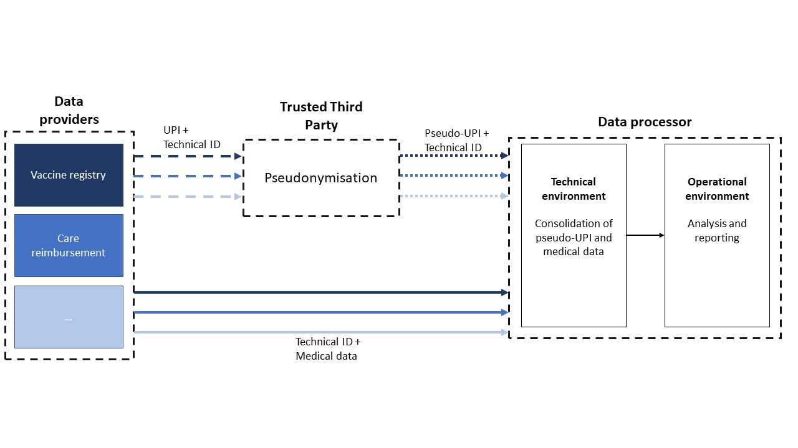

# DATA LINKAGE PROCESS - ARCHITECTURE

The Data Linkage tool is a process, more than a tool or service. As such, the exact architecture will vary across the implementers to meet their own constraints and needs. However, some key elements and principles should be present in all implementations (Figure 1):

-   a secure data server,
-   a distinct technical and operational environment and
-   a pseudonymisation step.

Figure 1. Example of architecture of data linkage and dataflow associated.

**Secure data server**

The collected data contain medical and personal information. For privacy protection and legal compliance, they must be hosted on a secure data server. In addition, a data breach would be harmful regarding citizens trust and continuity of the health surveillance operation.

Some key features of a secure server are:

-   **Encryption :** the data should be encrypted both at rest and during transit (using protocols like TLS/SSL).
-   **Access control**: having a strong password policy and using multifactor authentication (MFA) helps creating a strong authentication process. This goes along with role-based access control (RBAC) to limit the number of users having access to the most sensitive information.
-   **Security monitoring:** to identify and respond to potential threats, a continuous monitoring, the use of a logging system, and regular security audits such as vulnerability assessment and penetration tests.

**Distinct technical and operational environment**

An important feature is the separation between the technical environment and the operational environment. The former is dedicated to all technical processes such as the actual linkage, data consolidation and data validation. The latter contains only the processed, pseudonymised datasets and is where the data analysis to monitor the situation and answer policy/research questions are conducted.

Building on the access control characteristic of a secure server, both environments should meet the same requirement in terms of authentication. A role-based access is important as well, meaning that people conducting the technical processes should be different from the ones conducting the analysis (the separation principle). Despite this, there is still a risk of reidentification of the patient even with pseudonymised data. This is particularly the case when multiple databases are cross-linked, since many indirect identifiers (e.g. age, zip code, profession, etc.) and identifiable data (e.g. rare chronic condition) are combined. If this is the case, persons working with the operational data should be asked to sign a declaration of *'good clinical practice'*, which stipulates the purposes of working with the data.

In addition, for the operational environment more specifically, access to the data should be limited to people mandated to monitor the situation and support policy, or having operational goals aligned with the objectives and motivations of the data linkage. These motivations and objectives, as well as the evaluation of a research project, should be discussed within a decision board (which could include representatives of the different data providers).

Also, to mitigate the reidentification risk, only aggregated data should be exported from the operational environment.

**Pseudonymisation**

Ideally, the medical data are never shared along with the UPI or to the same party. To achieve this, the pseudonymisation step is handled by a TTP and in such a way that medical data are never transferred along with the UPI.

One way to achieve this is to ask the data providers to split their data in two parts. In the first part, the UPI will be replaced by a technical ID. This dataset containing generated ID and medical data will be sent directly to the data processor. The second part contains the list of UPI with their matching generated ID. This list goes through the TTP to replace the UPI by a pseudo-UPI using deterministic encryption[^1]. Once the data processor (which can also be a data providers) receives both part of the data, they can consolidate the message by reuniting the pseudo-UPI and the medical data based on the common generated ID. After consolidation and data validation, this generated ID is definitively deleted, and the consolidated dataset is made available in the operational environment. The TTP keeps the technical ID for future updates or in case data checks need to be performed.

[^1]: *The same pseudonymisation key is used for every data provider, ensuring that a UPI is always transformed to the same pseudo-UPI.*

Depending on the number of data providers and their relationship, the rest of the architecture, and local regulation, the pseudonymisation process can vary. It is nonetheless essential that it occurs before the data reach the research environment and are analysed.

The whole data linkage process, or sections of it, can initially be tested using synthetic data in order to validate certain technical aspects before using ‘*real’* data. (Further information on synthetic data is available in [Data module](Linkage%data.md))
