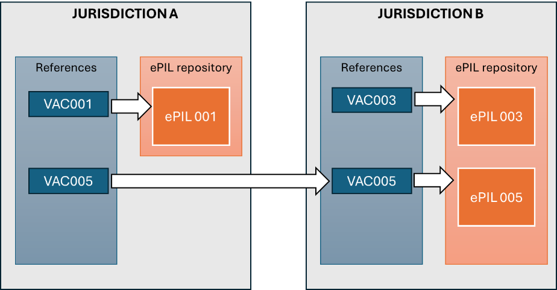

# ELECTRONIC PATIENT INFORMATION LEAFLET (ePIL) - ARCHITECTURE

Offering the ePIL as a service to citizens implies several stages:

-   ePIL documents must be available online, either as constituted documents (online PDF versions of the PIL) or as structured information.
-   The applicable ePILs for a given health jurisdiction must be identified
-   The links to the applicable ePILs must be publicized from a trusted source.
-   The citizen must have access to a tool that retrieves and presents the applicable ePIL for a given vaccine and a given health jurisdiction.

## Availability of ePIL documents or contents

Because of the different marketing authorisation procedures, the ePIL documents are spread across different sources, such as the PLM portal for vaccines under the centralised procedure or various portals from the different national competent authorities.

The online availability of ePIL is today partially achieved:

-   The [EMA database for centrally approved products](https://www.ema.europa.eu/en/medicines) is comprehensive but exposes single PDF documents that gather the summary of product characteristics, the labels and the patient information leaflet. These documents are massive (hundreds of pages) and hardly accessible to non-specialists.
-   Standalone ePIL can be found on several national authorities’ portals, but only for locally approved vaccines.
-   The new EMA Product Lifecycle Management portal would provide the product information in a semi-structured way, allowing to recompose the ePIL. But at the time of writing (Feb. 2026) its content is limited to 24 medicines, and only one vaccine.

For this reason, the EUVABECO project focused on the mechanisms to reference and distribute the ePIL, rather than the experience of end users.

## Identification of applicable ePILs for a jurisdiction

A region, a state, or a supranational organisation can all be health jurisdictions, with specific authorisation or documentation procedures. Within a given health jurisdiction, relevant ePILs can be held into a local repository, or fetched from other jurisdictions. This would be the case for centrally approved products, but also when vaccines are imported from a neighbouring state.

When such an interdependency between different jurisdiction exists, it is important that changes in the ePIL applied by the owning jurisdiction are propagated to the other using jurisdictions with a minimal overhead.

Technically, this is supported by indirect references. When using and ePIL curated by another jurisdiction, it should not be addressed by its explicit address into the online repository, but by a reference for this address managed by the owning jurisdiction.

Figure 1 - Indirect reference to an ePIL

## Trusted directory of references

A health jurisdiction must then curate not only its own repository of locally approved vaccines, but also the list of references for all ePILs that are relevant for its population.

This list of references is presented with two equivalent representations:

-   A machine-readable format, used by client applications to retrieve the currently applicable set of references for the given jurisdiction.
-   A redirection server, serving to Web browsers redirection either to the ePIL in the local repository or to a further redirection by the redirection server for another health jurisdiction.

The format of references is standardised, and composed from:

-   A code for the health jurisdiction
-   A code for the vaccine product
-   Possibly, an index if variants with relevance to the patient exist for a same vaccine product. For example, there are different ePIL for a same vaccine composed of a powder and a solvent, if the solvent can be delivered either as prefilled syringes or within a flask.
-   A type of document, to accommodate for the support of this referencing mechanism for other documents than the ePIL. Typically, this could be the Summary of Product Characteristics.
-   A language for the reader.
-   The URL for the document, or for its entry on a redirection server of another health jurisdiction.
-   

Figure 2 -Data model for references

Within the EUVABECO pilot projects, the machine-readable format is a YAML file in a [public GitHub repository](https://github.com/EUVABECO/epil).

## Redirection server

The redirection server uses a general-purpose Web server with a configuration file implementing the redirections described into the machine-readable format.

Technically, it would be possible to implement a redirection server only for the references directly curated by the health jurisdiction, and to rely upon the redirection servers of the other health jurisdiction for indirect references. But in case of failure of such an upstream redirection server, the service would be lost without possible action of the implementer. It is us rather recommended that each implementer retrieves the machine-readable files for all the source jurisdiction and builds its standalone redirection server for all references, direct or indirect.

Within the EUVABECO pilot projects, a common redirection server has been implemented[^3]. Its configuration is automatically generated on each update of the machine-readable files.

[^3]: <https://epil.euvabeco.eu>

Further technical details can be found in the documentation folder of the GitHub repository.

## Citizen tools to access the ePIL

Citizens may have three different paths to access an ePIL:

-   From the package of a vaccine, using a dedicated mobile application to get the ePIL for the given product.
-   From an application exposing their personal health records, such as the public access to an IIS, to retrieve the information regarding a vaccine they were administered or prescribed.
-   From a general information portal, where they would select any referenced vaccine.

### Accessing the ePIL from a vaccine package

This supposes the existence of:

-   A mobile application used to scan the Datamatrix code from the package, fetch the online ePIL content and display it.
-   A reference mechanism from the Datamatrix content to the relevant ePIL resource within the current health jurisdiction.

The main difficulty lies in the second point. The Datamatrix content identifies the product with a Data Carrier Identifier (DCI), that is generally the GTIN code for the product allocated by the GS1 Organization, although exceptions exist (GS1-alike codes in France, use of the PPN number in Germany).

This identifier varies with all presentations of the product, and there is no publicly available resource that would bind it to a given vaccine. Yet, this information is available within the infrastructure implemented for the execution of the Falsified Medicines Directive and could possibly be aligned with the vaccine codes used for the standardised references described above. However, this is not under the control of any individual Member State and should be handled at the European level.

A prequel of such a system exists within the Luxembourg national IIS, using GTINs collected indirectly from vaccination facilities.

### Accessing the ePIL from personal immunization records

The application used to present the immunization record to the citizen can fetch the ePIL references in the machine-readable format described above.

The ePIL reference gives a link to the ePIL document, either directly or through redirections. The application only has to open a browsing window, either in-app or from the terminal browser, to visualise or download the ePIL.

In almost all cases, the ePIL is a PDF document. In the case of an ePIL rebuilt from structured content, it is preferable to have the ePIL viewer as an independent common application, rather than to impose on each consuming application to include the rebuilding process. Such an application has been developed within the EUVABECO project and can be reused by implementing countries[^4].

[^4]: <https://epil.euvabeco.eu/list-plm> to list PLM contents  
    <https://epil.euvabeco.eu/view-plm?bid=Bundle/5607431d-78f2-ee11-904c-000d3aaa0e40> for viewing an ePIL  
    <https://github.com/EUVABECO/epil/tree/main/website> for the source code

EUVABECO uses the same code system, NUVA, for the European Vaccination Card and for the references to ePIL. The application may use a different codification for its vaccines but can use the [transcriptions provided in NUVA](https://github.com/IVC-NUVA/NUVA/tree/main/Release/Alignments) both for the delivery of the EVC and for the referencing of the ePIL.

### Accessing the ePIL from a list of referenced vaccines

The name for each vaccine is included into the machine-readable references format, including occasional language variants (typically when the term “Children” is included into the vaccine name).

This makes it easy to create an application that retrieves the list of references applicable for a given jurisdiction, then display them with the corresponding links.

A [simplistic, client-side application](https://epil.euvabeco.eu/list_epil) has been developed in EUVABECO and can be used as a basis for a national portal.
