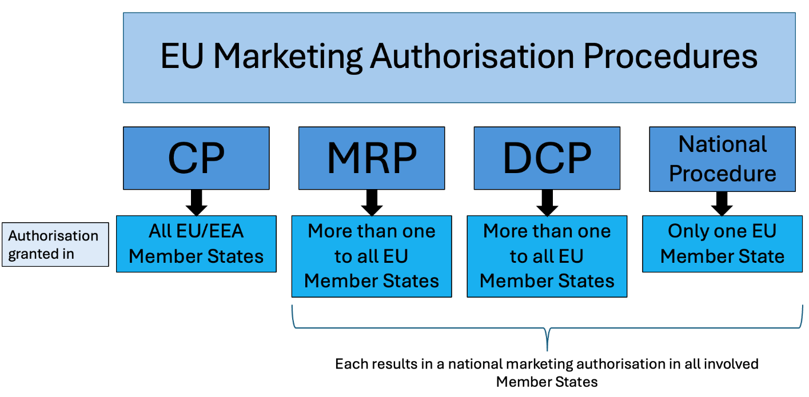
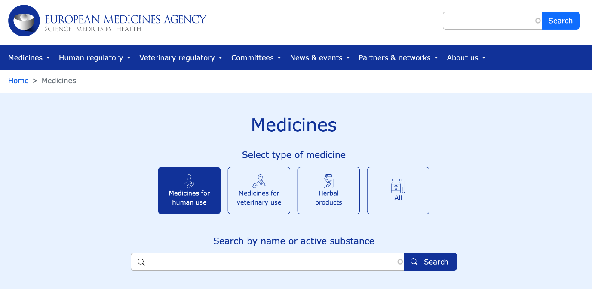
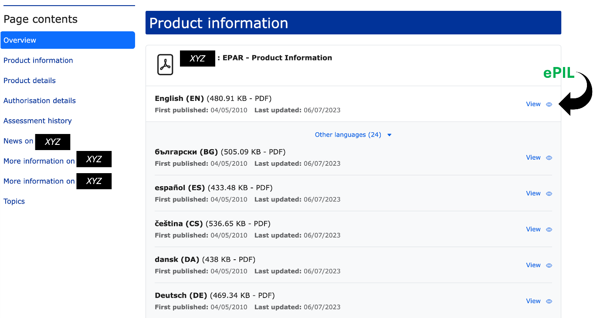
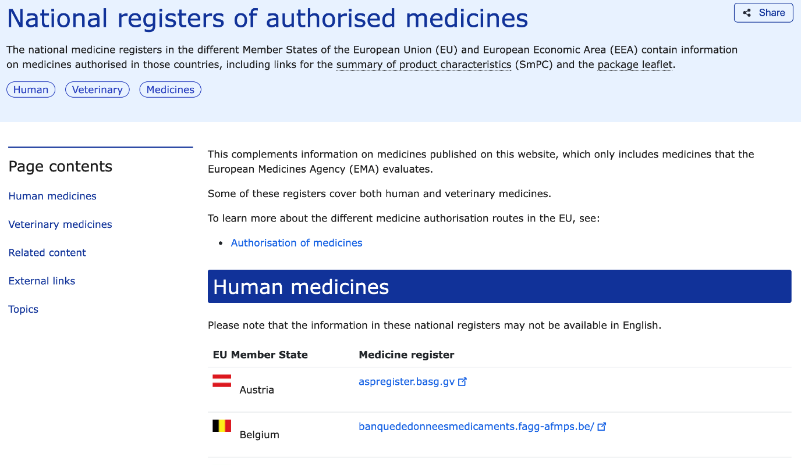
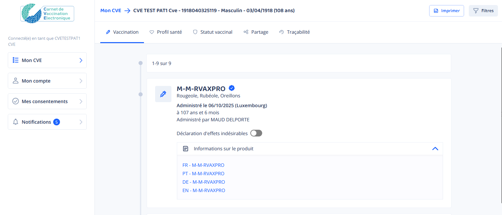

# ELECTRONIC PATIENT INFORMATION LEAFLET (ePIL) - FUNCTIONAL DESCRIPTION
*This section provides a functional overview of the intended tool and its usage. It outlines the goals and features without referring to any specific implementation.*

## Objectives

*This section is the overall rationale for the tool.*

The ePIL allows to provide to EU citizens detailed information about a vaccine, including administration, precautions and potential side effects, in an electronic format. This information must be available from the vaccine package, replacing the paper-based information leaflet. It should be also available from the designation of a vaccine that was administered in the past or could be administered in the future.

The availability of an ePIL secures the accuracy and timeliness of the delivered information. If used as a replacement for the paper PIL, it facilitates the transfer of vaccine products between different health jurisdictions, allows to reduce wasted packages, optimizes storage and refrigeration.

Making the patient information easily accessible from routinely used patient portals is a factor of transparency and trust.

## Involved stakeholders and their expectations

*This section outlines the various stakeholders within the implementing Member State who will use or contribute to the tool. Their expectations represent essential requirements for any implementation.*

For the successful implementation of the ePIL, various stakeholders play crucial roles, each with specific expectations and responsibilities. The key stakeholders are:

-   Citizens/Patients
-   Healthcare Professionals (HCPs)
-   National Competent Authority (NCA)
-   European Medicines Agency (EMA)
-   European Commission (EC)
-   Vaccine Manufacturers
-   Electronic Health Record (EHR) Suppliers
-   e-Health Infrastructure Operators

### Citizens/Patients

Individuals who receive, access, and use the ePIL expect easy access to accurate and timely information about their medicinal products, user-friendly interfaces and multilingual information.

### Healthcare Professionals (HCPs)

HCPs, including hospital practitioners, general practitioners, pharmacists, and nurses, who administer vaccines and provide trustworthy information to the public, expect efficient systems to access and deliver ePILs, potentially integrated with existing electronic health records (EHRs) and prescribing systems, and assurance that the ePILs are up-to-date and accurate. HCPs that administer vaccines can vary among EU Member States.

### National Competent Authority (NCA)

NCAs, primarily responsible for the authorisation of medicinal products available in the EU that do not pass through the centralised procedure, expect ePIL systems to facilitate efficient regulatory processes and ensure the authenticity and accuracy of information. The list of NCAs in the EU/EEA can be found [here](https://www.ema.europa.eu/en/partners-networks/eu-partners/eu-member-states/national-competent-authorities-human).

### European Medicines Agency (EMA)

The EMA, overseeing the centralised marketing authorisation procedure, expects ePILs to meet EU standards for quality, safety, and efficacy. The EMA oversees regulatory standards and manages its [database for centrally approved medicinal products](https://www.ema.europa.eu/en/medicines). It is also responsible for the [Product Lifecycle Management (PLM) Portal](https://plm-portal.ema.europa.eu/), the pilot project that includes hosting and accessing ePILs.

### European Commission (EC)

The EC expects compliance with EU legislation and alignment of ePIL initiatives with broader European objectives.

### Vaccine Manufacturers

Vaccine manufacturers seek streamlined regulatory processes for incorporating ePILs, with flexibility to update content in real-time and reduce logistical burdens by replacing paper leaflets with digital versions. They also advocate for globally aligned industry standards to avoid the complexity of differing requirements across regions and request flexibility in how ePIL content is disseminated, enabling companies to implement patient-focused mechanisms for delivery.

### Electronic Health Record (EHR) Suppliers

EHR suppliers, providing digital systems for storing and managing patient health records, expect solutions for seamless ePIL integration. This implies that reliable ePIL directories for the vaccines authorized in a given health jurisdiction are available in a standardized format.

### e-Health Infrastructure Operators

Operators maintaining the technical infrastructure required for managing and sharing ePIL data securely and efficiently expect consistency with national or European regulations and integration with citizen portals and healthcare systems.

## Constraints

*Constraints are the non-functional requirements that, while not directly related to the tool's specific functions, are critical to its overall viability.*

For the successful implementation of ePIL, various constraints must be addressed. These constraints involve legal requirements, marketing authorisation procedures and printing requirements.

### Legal Framework

For medicinal products, EU legislation mandates that information appears on all packaging components in the official national language(s) of the country of distribution. With 24 official languages in the EU/EEA and some countries having up to three official languages, this creates logistical challenges. The small market size of many EU countries means vaccines often need to be delivered in small volumes with country-specific packs, further complicating the supply chain. Additionally, vaccines require refrigerated storage, limiting space and necessitating minimal packaging content. This constraint limits multilingual packs to a maximum of three languages, adding complexity.[^1]

[^1]: Vaccines Europe (n.d.). E-leaflet and vaccines common EU packaging.

    https://www.vaccineseurope.eu/wp-content/uploads/2022/09/VE-

    CommonPackaging_InfographicSHEET-V10_FINAL_UPDATE_WEB.pdf

The implementation of the ePIL is grounded in the existing legal provisions of the EU, particularly Directive 2001/83/EC, which governs the labelling and packaging of medicinal products. The Directive allows for certain flexibilities, especially under exceptional circumstances such as public health emergencies.

During emergencies like the COVID-19 pandemic, the EC and the NCAs exercised these flexibilities to streamline the approval and distribution process of COVID-19 vaccines. For instance, Member States have allowed the use of QR codes to provide access to translated package leaflets, and in some cases, have permitted the distribution of vaccines with minimal on-pack information, relying instead on digital resources for detailed patient information.

In the proposed revisions to the General Pharmaceutical Legislation, the EC and the European Parliament (EP) have suggested that Member States may eventually provide package leaflets electronically only. This change, anticipated to be possible from 2028, would allow for a fully digital provision of medicinal product information, potentially eliminating the need for paper leaflets inside packaging. The legislation also emphasises patients' rights to request a printed copy of the package leaflet free of charge, ensuring that no patient is left behind. If implemented, these revisions could allow the use of ePILs instead of paper leaflets without the current requirement of an exemption.

### EU Regulatory Procedures for a Marketing Authorisation

Marketing authorisation is the official approval granted by a regulatory authority to market a medicinal product within a certain jurisdiction. It ensures that the product meets necessary standards of quality, safety, and efficacy before being made available to the public.

For the implementation of the ePIL, the different regulatory procedures to marketing authorisation must be considered. The procedure through which a medicinal product receives its marketing authorisation dictates whether the exemption to use an ePIL instead of a traditional paper leaflet should be sought from the EMA or an NCA.

The two main procedures for obtaining marketing authorisation in the EU are the centralised procedure and the national marketing authorisation procedures, which include the decentralised and mutual recognition procedures[^2].

[^2]: EMA (n.d.). Authorisation of medicines. [https://www.ema.europa.eu/en/about-us/what-we-do/authorisation-medicines\#national-authorisation-procedures-10946](https://www.ema.europa.eu/en/about-us/what-we-do/authorisation-medicines#national-authorisation-procedures-10946)

The **centralised procedure (CP)** involves a single application that leads to one evaluation and one marketing authorisation valid across all EU Member States, as well as Iceland, Norway, and Liechtenstein. This results in a unified set of product information for HCPs and citizens/patients in all official EU languages.

The national marketing authorisation procedures consist of the decentralised procedure, mutual recognition procedure and national procedure.

-   **Decentralised Procedure (DCP)**: For products not yet authorised in any EU Member State, the decentralised procedure allows simultaneous applications in multiple countries, resulting in coordinated national approvals.
-   **Mutual Recognition Procedure (MRP)**: For products already authorised in one EU Member State, the mutual recognition procedure allows other Member States to recognise this authorisation, facilitating broader market access.
-   **National Procedure:** Independent national procedures are limited to medicines which are to be authorised and marketed in only one Member State. This procedure is nowadays rarely followed for new products.

### Implications for the ePIL Implementation

According to EU legislation, namely Regulation (EEC) No 2309/93 and Regulation (EC) 726/2004, new vaccines must go through the centralised procedure to obtain marketing authorisation in EU. However, some existing vaccines that obtained marketing authorisation before this legislation was in place were approved via national marketing authorisation procedures (including DCP and MRP) and continue this pathway for marketing authorisation maintenance. Therefore, when looking for trustful source of the patient information leaflet content, both the EMA and the NCAs websites need to be consulted.

The implementation of the ePIL involves several key considerations regarding regulatory compliance and the permissions required from both the EMA and NCAs. The process for obtaining a waiver from the legal obligation to include paper leaflets will vary depending on the marketing authorisation pathway of the medicinal product.

**Centralised Procedure (CP):** For medicinal products authorised through the CP, the EMA is the primary authority. As seen during the COVID-19 crisis, for CP products, a general exemption was granted where the EMA led the process but consulted with NCAs across the EU. This collaboration allowed for national recommendations to be made, and some Member States required the paper leaflet to be provided separately from the packaging. Therefore, for the exclusive use of the ePIL for products authorised through the CP, both the EMA and NCAs would need to be consulted to ensure compliance across all relevant jurisdictions.

**National Authorisation Procedures (DCP and MRP):** For medicinal products authorised through the DCP or the MRP, the relevant NCAs of the Member States are responsible. The NCA of each Member State involved in the authorisation process would need to grant permission to waive the legal obligation of paper leaflets. This means that for these products, manufacturers must navigate the regulatory requirements of each individual country where the product is marketed. The list of NCAs in the EU/EEA can be found [here](https://www.ema.europa.eu/en/partners-networks/eu-partners/eu-member-states/national-competent-authorities-human).

### Printing Logistics and Financial Responsibilities

For medicinal products, including vaccines, a significant constraint of the implementation of the ePIL is the debate over the logistics and financial responsibility for printing ePILs in pharmacies for those citizens/patients who require or prefer a paper version of the leaflet. Determining who will bear the costs of printing—whether it will be the responsibility of manufacturers, pharmacies, or another entity—remains unresolved. However, as vaccines are administered by healthcare professionals, this constraint should not be an issue for the implementation of the ePIL for vaccines. It is acknowledged that patients have the right to obtain a paper leaflet, with possible solutions including printing by a professional, such as the dispenser or care provider, or self-service printing options available at kiosks in pharmacies, retail outlets, healthcare centres, or community printing hubs.

In conclusion, while the implementation of ePILs offers significant benefits in terms of flexibility, efficiency, and environmental sustainability, addressing these constraints is crucial. Obtaining regulatory exemptions and resolving printing logistics are critical to the successful adoption of ePILs within the EU healthcare system.

## Use cases

*The following use cases illustrate how different stakeholders can use the CDS tool to meet their expectations. Each scenario demonstrates a specific function of the tool.*

### UC01 - Fetching the ePIL from an online repository

Lisa and Daniel are a young couple living in EU-country B, though they are originally from EU-country A. With a young child due for vaccinations, they want to ensure they have accurate information about the vaccines their child will receive, in their native language. Lisa and Daniel use the search function on the [EMA's database for centrally approved medicinal products](https://www.ema.europa.eu/en/medicines) to find the meningococcal group B vaccine "XYZ". The patient information leaflet is available in the Product Information section and can be accessed in all EU languages, including Lisa and Daniel's native language from country A. This allows them to access and understand the most up-to-date and accurate information about the vaccine their child will receive.

-   Use Case for a Nationally Approved Vaccine

Maria, a resident of EU-country A, is on holiday in EU-country B when she is bitten by an animal. She is promptly administered a rabies vaccine "XYZ" by a local doctor. However, the paper leaflet accompanying the vaccine is in the local language of country B, which Maria does not understand. To find reliable information, Maria visits the EMA’s website and navigates to the list of [National Registers of Authorised Medicines](https://www.ema.europa.eu/en/medicines/national-registers-authorised-medicines). She selects the link for her home country, which takes her to her national health authority’s website. There, she uses the search function to find the rabies vaccine "XYZ" and accesses the patient information leaflet in her native language, allowing her to review the latest information on the vaccine’s precautions and potential side effects with confidence.

### UC02 - Change of Leaflet Content

Vaccine manufacturer ABC produces the COVID-19 vaccine "XYZ," which has been centrally approved by the EMA. Due to the ongoing COVID-19 pandemic, ABC has received an exemption allowing the patient information leaflet to be accessed by scanning a Datamatrix code on the vaccine’s outer packaging, instead of providing a paper leaflet. ABC gathers more data on the vaccine and needs to amend the information on the vaccine’s potential side effects in the patient information leaflet. Rather than reprinting paper leaflets—a process that could delay distribution and cause vaccine shortages—ABC submits a request via Variation administrative procedure to the EMA to update the content of the digitally available patient information leaflet for vaccine “XYZ” across all EU languages. The EMA processes this request, ensuring that citizens/patients and healthcare professionals have immediate access to the most current and accurate vaccine information, simply by scanning the Datamatrix code on the packaging.

### UC03 – Accessing from an administered vaccine record

Mark has received a vaccine one week ago and is worried about a erythema on his arm. He connects to the national immunization information system where his vaccination history is recorded, selects the administered vaccine and the notice in his own language.

He can see there that this is a known and benign adverse event following immunization.

