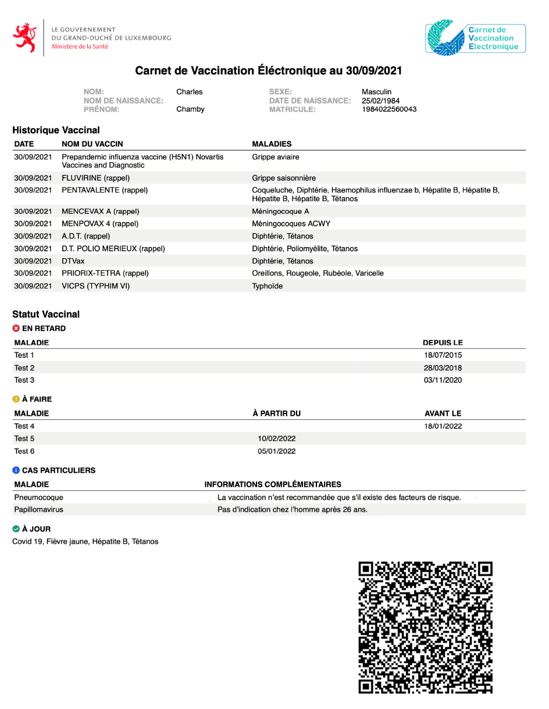
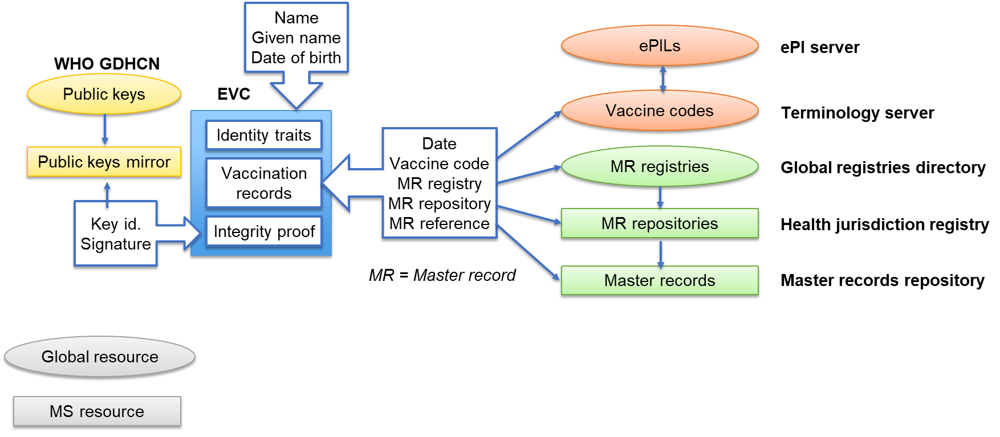
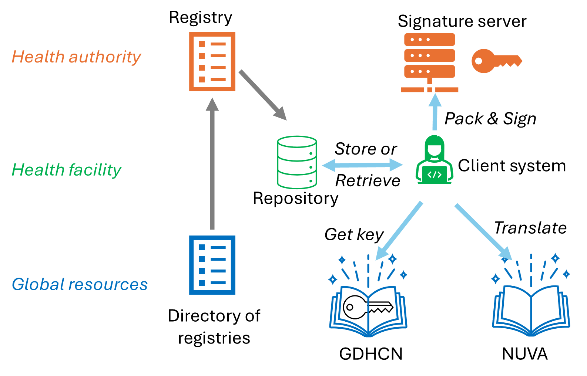

# EUROPEAN VACCINATION CARD (EVC) - ARCHITECTURE

The EVC is a PDF file encompassing the three representations of the same vaccination history:

-   As a human readable list of administered vaccines,
-   As a QR code within the document,
-   As a metadata of the PDF file, with a content identical to the QR code.

The digital part of the document (QRCode and metadata) consists of records that are digitally signed by a signature server, belonging to a member of the WHO GDHCN and operated according to the GDHCN rules.

Figure 1 - Example of an EVC

For each administered vaccine, these records include the reference to a master record, that is held by an accredited health facility in a participating MS.

Figure 2-EVC trust infrastructure

# EVC creation workflow

Creating this digital part requires three stages:

-   Collating the data to be included into the EVC
-   Compacting this data
-   Signing the compacted data

## Collating the data

The EVC is always produced from a system operated by an accredited health professional. This could be a centralized IIS for a country or a region, or his local EHR application.

This system can obtain the vaccine administration events from an already existing EVC, or from its own data if the vaccine was administered or registered locally, or from connected trusted repositories such as a national IIS.

When an event is registered locally, this constitutes a master record for the given administration. It is possible, and not contradictory, that several master records exist for a same administration.

Each master record is uniquely identified by:

-   The master record holder, or repository, itself identified by a registry (typically, one per health authority) and an index within this registry.
-   The date of administration and an index (reference) for this date. It belongs to the repository software to assign these indexes, typically as a counter across vaccines registered on a given day.

Once the master records for all vaccines are identified, the EHR application can constitute the payload for the EVC and submit it for compaction.

The payload is a JSON structure with the following content:

| L1    | L2  | L3  | Card. | Type   | Example             | Comment                                         |
|-------|-----|-----|-------|--------|---------------------|-------------------------------------------------|
| iss   |     |     | 1..1  | String | LUX                 | Issuer of the EVC                               |
| iat   |     |     | 1..1  | NDate  | 1736787882          | Date of issuance                                |
| exp   |     |     | 1..1  | NDate  | 2092554938          | Expiration date (10 years after issuance)       |
| hcert |     |     |       |        |                     |                                                 |
|       | ver |     | 1..1  | string | 1.0.0               | Version of the structure                        |
|       | nam |     | 1..1  |        |                     | Basic identity traits                           |
|       |     | fnt | 1..1  | string | DOE                 | Name                                            |
|       |     | gnt | 1..1  | string | John                | First or usual given name                       |
|       | dob |     | 1..1  | date   | 2017-07-19          | Date of birth                                   |
|       | pid |     | 0..1  |        |                     | Optional digital identifier for the person      |
|       |     | oid | 1..1  | string | 1.2.250.1.213.1.4.8 | Object identifier for the identification scheme |
|       |     | id  | 1..1  | string | 1630777186051       | Person identifier within the scheme             |
|       | v   |     | 0..\* |        |                     | Vaccine administration records                  |
|       |     | reg | 1..1  | string | LUX                 | 2 to 6 letters code for a registry              |
|       |     | rep | 1..1  | int    | 5                   | Index for a repository in a registry            |
|       |     | i   | 1..1  | int    | 1296                | Reference within a repository for a given date  |
|       |     | a   | 1..1  | int    | 1386                | Age in days when the vaccine was administered   |
|       |     | mp  | 1..1  | int    | 29                  | NUVA code for the vaccine (here REPEVAX)        |

The minimal identity traits for identity check by the health professional (family name, given name and date of birth) can optionally be complemented by a digital identifier specific to the delivering country. The reuse or interpretation of this identifier is not required from other health jurisdictions.

## Compacting the data

Three settings are possible for the compacting stage:

-   It is performed locally by the health professional system. It is the most protective of personal data, since only an unidentifiable hash of the compacted data is sent to the signature server, but also the most complex and costly for the EHR supplier.
-   It is performed centrally by the entity owning the signature server, based upon a transmission of the collated data. This is relevant is this authority is bound to the health authority.
-   It is performed by an intermediate entity, acting on behalf of the health authority but hiding the health data from the signing entity.

The choice among the three options has to be done from the setup of the implementation project.

The compacting process is systematic and consists in converting the JSON payload to Concise Binary Object Representation (CBOR), as described in RFC8949[^1].

[^1]: <https://datatracker.ietf.org/doc/html/rfc8949>

## Signing the compacted data

The digital part of the EVC is always signed by a signature server, belonging to a member of the WHO GDHCN and operated according to the GDHCN rules.

The signature is performed according to the CBOR Object Signing and Encryption (COSE) standard and described in RFC9052[^2] and RFC9053[^3].

[^2]: <https://datatracker.ietf.org/doc/rfc9052>

[^3]: <https://datatracker.ietf.org/doc/rfc9053>

## Creating the document

Finally, the system used by the health professional will create the EVC document itself, with all three representations embedded into a single PDF file.

# Importing an EVC

A consuming system can import an EVC by:

-   Acquiring its digital format, either by reading the file metadata or by optical capture of the QR Code.
-   Checking its integrity with the signature, using the public key available from the GDHCN and corresponding to the key identifier present into the signed content.
-   Expanding it to the processable JSON format.
-   Retrieving the information from the JSON format and complementing it with the knowledge from the NUVA terminology, such as the vaccine name or some alternative codification.

# Components to be deployed

To implement the EVC, a MS will thus need to deploy:

-   One or several systems able to create or import EVCs for health professionals
-   Optionally, an intermediate server for compacting the data
-   A signature server participating into the WHO GDHCN network
-   One or several registries, referencing the repositories where master records are held
-   Optionally, one or several repositories for master records, if they are not integrated into the systems used by the health professionals.

These national components rely upon static global resources:

-   The NUVA terminology repository, providing the codes for vaccine products,
-   The WHO GDHCN root server, listing the allowed signature keys,
-   The EU directory of registries, listing the registries of repositories held by MS.

Figure 3- Components diagram
