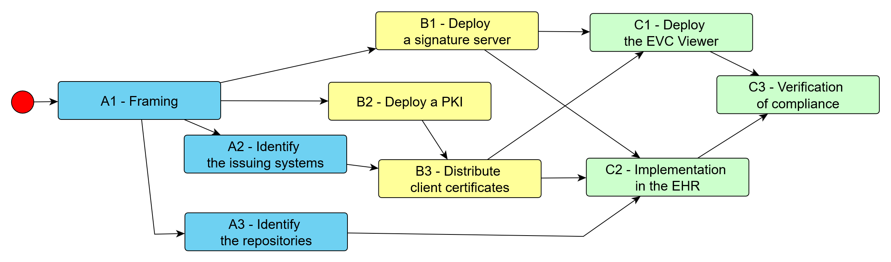

# EUROPEAN VACCINATION CARD (EVC) - DEPLOYMENT

# Project team

The project team consists of representatives from:

-   The Health authority, that will drive the decisions about the overall structure (A1 task below) and create the regulatory frame for verification of compliance (C3)
-   The eHealth operator, that will deploy the registry of repositories (A3), possibly a repository of its own, and the EVC viewer (C1)
-   The digital signature operator (possibly identical to the eHealth operator), that will provide the signature infrastructure (B1), create (B2) and distribute to the EVC issuers the certificates granting access to that infrastructure (B3).
-   One or several pilot EHR suppliers, that will implement the EVC delivery and import feature in their products (C2) and run the compliance tests (C3) for their implementations.
-   One or several pilot health facilities, participating in the assessment of the useability of the applications from their EHR suppliers (C3).

# Workflow

After an initial framing, the project consists in three branches:

1.  Identifying the participating systems and actors
2.  Setting up the signature infrastructure
3.  Implementing into the selected EHR applications

The diagram below summarises the dependencies between the tasks in these branches.

Figure 1- Implementation workflow overview

## A1 – Framing

The decisions impacting the overall structure within the MS will be taken during this stage:

-   How many registries are needed, and who will keep them
-   Where will be the master records
-   Which health professionals will deliver EVCs
-   From which systems will be delivered the EVCs
-   Who will operate the signature servers
-   In which languages the EVC should be delivered

The structure with registries and repositories is designed to accommodate for very variable settings.

There could be only one registry for a country, or several registries kept at substate level and curated by local health authorities.

Similarly, within a health jurisdiction (state or substate), there could be a single central repository, one repository for each health facility, or a hybrid model such as a central repository for independent professionals and local ones within hospitals and vaccination centres.

The systems used by health professionals to deliver the EVCs may be distinct from the repositories for master records. For example, these repositories could be shared across a several systems. The systems themselves will be accredited for submitting EVCs to signature; they will have to handle locally the authorisation of their using health professionals, based upon the rules set during the framing (A1).

Even when a same system has the two roles of issuing system and of repository, it has different identifiers for the two roles. The identifier as a repository is a mere index within the registry, while the identifier as an issuing system is a X509 Distinguished Name[^1].

[^1]: <https://datatracker.ietf.org/doc/html/rfc2459>

The signature servers should be deployed by the existing or intended national GDHCN participant.

## A2 – Identify the issuing systems

The systems allowed to request for the signature of an EVC must be uniquely identified. This identification will be used later for the distribution of client certificates (B2).

When the issuing system is not unique, the organisation for updating the list of accredited systems must also be defined.

## A3 – Identify the repositories

The owners for the registries identified during the framing (A1) must allocate a unique identifier to the repositories holding the master records within their jurisdiction. Each repository should be documented with a contact information, mandated to process the requests for verification.

The identifiers do not have to be public but must be communicated to the owners of the repositories and of the issuing systems for their configuration during the implementation phase (C2).

## B1 – Deploy a signature server

In the implementation considered here, the signature server also performs the compacting process.

It is deployed by the participating digital signature operator, based upon the specifications referenced here at chapter 4- Build resources. He may reuse the reference implementation or any other compliant solution.

The signature server is fully stateless, meaning that it can be replicated in as many instances as needed behind a load balancer to support the incoming traffic.

It is exposed on the Internet as a Web service, with its access restricted using the TLS client certificate authentication. The robustness of the used cipher suites is verified at deployment time, then once every six months.

## B2 – Deploy a PKI for issuing systems

Each issuing system will have to authenticate to the signature server, using a X509 certificate1 for the identity that was assigned during the identification of participants (A2).

The digital signature operator creates a Public Key Infrastructure (PKI) in order to generate, distribute, and whenever needed revoke these client certificates.

## B3 – Distribute client certificates

The digital signature operator must address to each structure administering a client system its client certificate, during initial setup and for periodic renewal.

The actual process for this distribution depends upon the preexisting infrastructures and processes of the digital signature operator. It varies from postal delivery of a physical support to online retrieval by an accredited administrator.

## C1 – Deploy the EVC viewer

The participating eHealth operator will deploy the citizen oriented EVC viewer as the first example of an EVC client system. It differs from regular EHR applications by the fact that it does not include a repository.

A reference implementation for an EVC viewer is provided as a resource from the EUVABECO project.

This EVC viewer has to be configured with a client certificate (B3) in order to be able to deliver EVCs with self-declared records. It will be used later as a first testbed to check that EVCs produced by EHR implementations (C2) can be read.

## C2 – Implementation in the EHR application

Each EHR supplier for a client system should now perform its own integration of the EVC, including:

-   Reading an EVC:
    -   The acquisition of the digital section of an EVC, either as an uploaded PDF file or using a barcode reader
    -   The verification of the signature for the acquired data
    -   The unpacking of the EVC data into a patient record. This may imply transcribing the administered vaccine codes from the NUVA universal encoding to the locally used code system.
    -   The resolution of potential conflicts will already existing records. The policy document for this resolution is provided as a resource from the EUVABECO project.
-   Writing an EVC:
    -   If the master records repository for the given EHR application differs from the local storage, the transfer of patient vaccination events to the repository and the retrieval of the corresponding reference for each record.
    -   The assembling of the EVC payload
    -   The submission to the compacting and signature server. This requires the use of the client certificate previously delivered (B3).
    -   The creation of the PDF format enriched with the digital content returned by the signature server.

## C3 – Verification of compliance

Compliant implementations must be able to read EVCs provided from any other compliant system, and to write EVCs that can be read from other systems.

Compliance is verified through a verification process consisting of:

-   Reading in an imposed sequence a set of reference EVCs for several test patients
-   Adding to these patients an imposed set of vaccines
-   Creating the corresponding EVCs and testing them against the expected results

The test suite, with the set of reference EVCs, the list of vaccines to add and a checking tool to compare the produced EVCs with the expected results, is provided as a resource by the EUVABECO project.

# Typical planning

|                                          | M1 | M2 | M3 | M4 | M5 | M6 |
|------------------------------------------|----|----|----|----|----|----|
| A1 – Framing                             |  X |    |    |    |    |    |
| A2 – Identify the issuing systems        |    |  X |    |    |    |    |
| A3 – Identify the repositories           |    |  X |    |    |    |    |
| B1 – Deploy the signature servers        |    |  X |    |    |    |    |
| B2 – Deploy a PKI for client systems     |    |  X |    |    |    |    |
| B3 – Distribute client certificates      |    |    |  X |    |    |    |
| C1 – Deploy the EVC viewer               |    |    |  X |    |    |    |
| C2 – Implementation in the EHRs          |    |    |  X |  X |  X |    |
| C3 – Verification of the implementations |    |    |    |    |    |  X |

# Build resources

| Content                                                                           | Link                                                                                                   |
|-----------------------------------------------------------------------------------|--------------------------------------------------------------------------------------------------------|
| Detailed specification of the EVC digital content (under its global name of CLVR) | <https://github.com/IVC-NUVA/CLVR>                                                                     |
| Publication of NUVA terminology                                                   | <https://github.com/IVC-NUVA/NUVA>                                                                     |
| Reference implementation for a signature server                                   | <https://github.com/EUVABECO/signer>                                                                   |
| Implementation of a EVC scanner (source)                                          | <https://github.com/EUVABECO/evc_scan>                                                                 |
| EVC scanner exposed                                                               | <https://evc.euvabeco.eu>                                                                              |
| Standalone encoder and decoder                                                    | <https://github.com/EUVABECO/EVC-generator>                                                            |
| Alternative keystore (documentation)                                              | <https://github.com/EUVABECO/implementation-plans/blob/main/5-EVC/Resources/Keystore.md>               |
| Alternative keystore exposed                                                      | <https://keys.euvabeco.eu/.well-known/jwks.json>                                                       |
| Deduplication policy                                                              | <https://github.com/EUVABECO/implementation-plans/blob/main/5-EVC/Resources/EVC%20deduplication.md>    |
| Registry management policy                                                        | <https://github.com/EUVABECO/implementation-plans/blob/main/5-EVC/Resources/Registry%20management.md>  |
